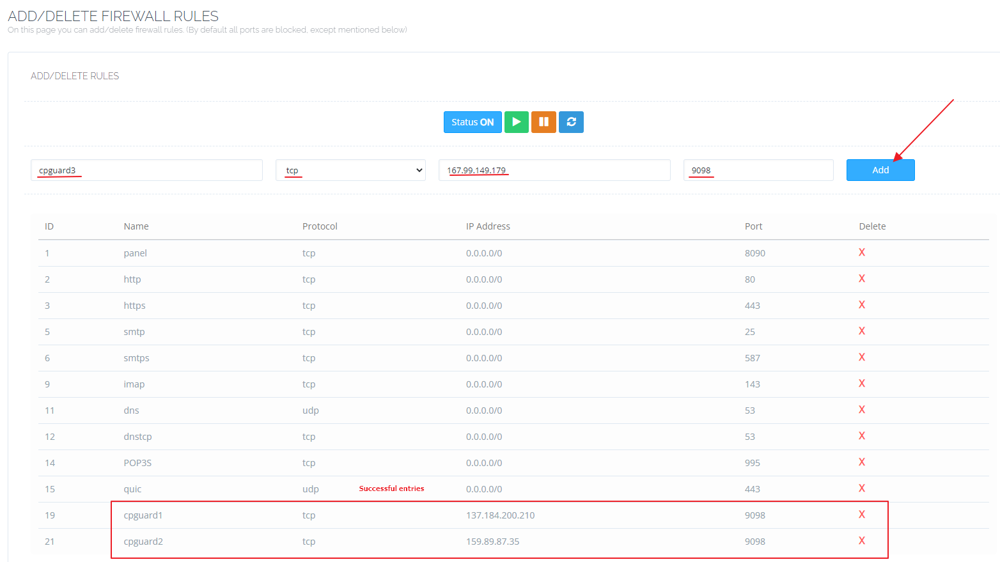

# Install on CyberPanel

**CyberPanel** is one of the most popular Linux server control panels for spinning up web hosting environments powered by **LiteSpeed** and **OpenLiteSpeed**. Its open-source nature and multi-user design make it a go-to choice for developers and hosting providers alike. But like any publicly accessible server, it needs a robust security layer and that's exactly what cPGuard provides.

This guide walks you through installing cPGuard on a CyberPanel server and configuring it correctly so it can protect your sites at every layer.

{/* comment */}

---

## What Is CyberPanel?

CyberPanel is a feature-rich, open-source Linux control panel built around the LiteSpeed and OpenLiteSpeed web servers. It supports multi-user hosting environments with individual website access and includes built-in email features. Both free and commercial (Pro) versions are available.

Because CyberPanel servers are often used for shared hosting with multiple users and websites on a single machine securing them against malware, web application attacks, and intrusion attempts is essential.

---

## How cPGuard Protects CyberPanel Servers

As a **Web Security Suite**, cPGuard protects CyberPanel servers through multiple security modules operating across different layers:

- **Malware Scanner** : continuously monitors website files for threats
- **Web Application Firewall (WAF)** : blocks common web attacks via ModSecurity rules
- **IP Reputation & Country Blocking** : filters traffic from known-bad IPs and regions
- **Automatic File Cleanup** : removes injected malicious code from infected files
- **Email Notifications & Reporting** : alerts on detections and provides daily summaries

Installation and configuration use the **cPGuard Standalone** setup.
---

## Step 1 : Install cPGuard on CyberPanel

Run the following single command on your CyberPanel server as root to download and execute the cPGuard installer:

```bash
cd /usr/local/src && rm -f cpguard_install.sh && curl -o cpguard_install.sh -L https://downloads.opsshield.com/cpguard/cpguard_install.sh && bash cpguard_install.sh LICENCE-KEY
```

Replace `LICENCE-KEY` with your actual cPGuard license key purchased from OPSSHIELD.

**What the installer does:**

1. Downloads the latest cPGuard installer script
2. Installs all required dependency packages for your operating system
3. Applies the license key and binds the server to your **cPGuard App Portal** account
4. Displays a success message with a **direct link to your server** in the App Portal

:::note
The license key is **mandatory** to complete the installation. Without it, the server cannot be bound to the App Portal and cPGuard features will not be fully activated. If you don't have a license yet, you can get one at [opsshield.com](https://www.opsshield.com/cpguard-pricing.html).
:::

:::tip
After installation, you can manage all cPGuard settings for this server directly from the [cPGuard App Portal](https://app.opsshield.com) without needing to SSH into the server for most tasks.
:::

---

## Step 2 : Install and Configure ModSecurity (for WAF)

To enable the **Web Application Firewall (WAF)** on your CyberPanel server, ModSecurity must be installed and configured. The WAF is one of cPGuard's most powerful protection layers, so this step is strongly recommended.

Refer to the dedicated guide for CyberPanel-specific ModSecurity installation and configuration:

 [cPGuard WAF Panel-Specific Steps](../../waf/panel-specific-steps)

Follow the CyberPanel section of that guide to ensure ModSecurity is set up correctly before enabling WAF rules.

---

## Step 3 : Whitelist App Portal IPs in the CyberPanel Firewall

The cPGuard agent service runs on your server and listens on **TCP port 9098**. The cPGuard App Portal needs to be able to reach this port to communicate with the agent and manage your server remotely.

After installation, you must whitelist the following App Portal IP addresses for TCP port 9098 in the CyberPanel firewall:

```
137.184.200.210
159.89.87.35
167.99.149.179
```

**How to add the whitelist rules in CyberPanel:**

1. Log in to your **CyberPanel** admin interface.
2. Navigate to **Server → Security → Firewall**.
3. Add each of the three IP addresses above, allowing access on **TCP port 9098**.




:::danger
If you skip this step, the cPGuard App Portal will not be able to connect to your server's agent service. You will be unable to manage cPGuard settings remotely or view server data in the App Portal until the firewall rules are in place.
:::

---

## Installation Checklist

Use this checklist to confirm all steps are complete before testing your setup:

| Step | Task | Status |
|---|---|---|
| 1 | Run the cPGuard installer with your license key | ☐ |
| 2 | Confirm installation success message and App Portal link | ☐ |
| 3 | Install and configure ModSecurity for WAF support | ☐ |
| 4 | Whitelist App Portal IPs in CyberPanel Firewall (port 9098) | ☐ |
| 5 | Open the App Portal and verify the server appears | ☐ |
| 6 | Enable WAF, scanner, and other security modules as needed | ☐ |


---
