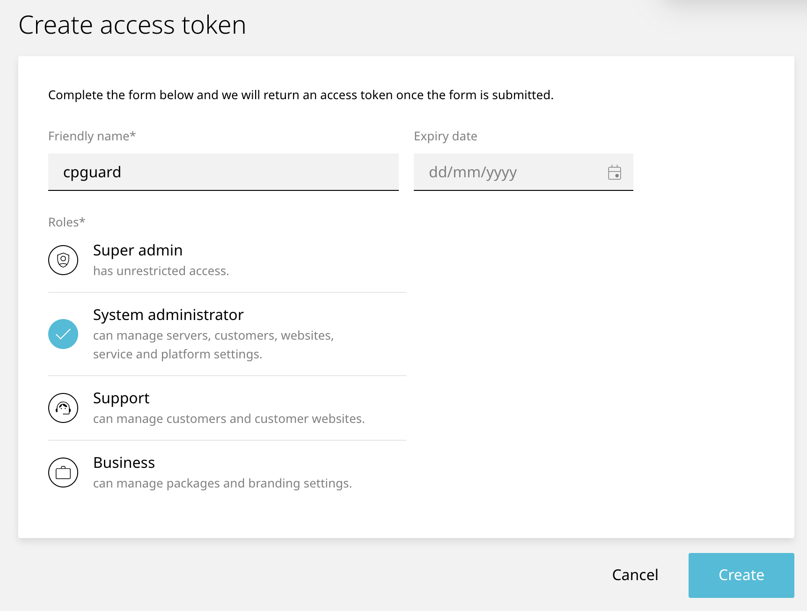
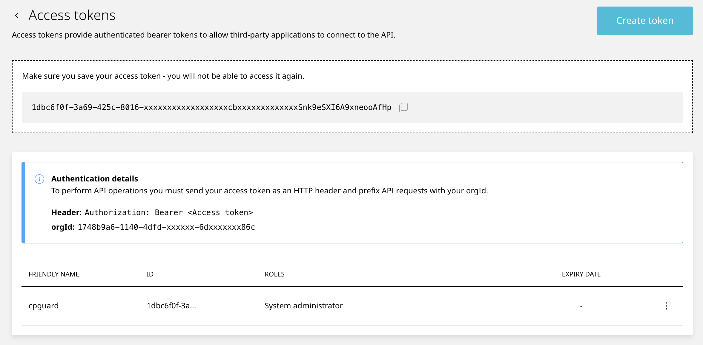
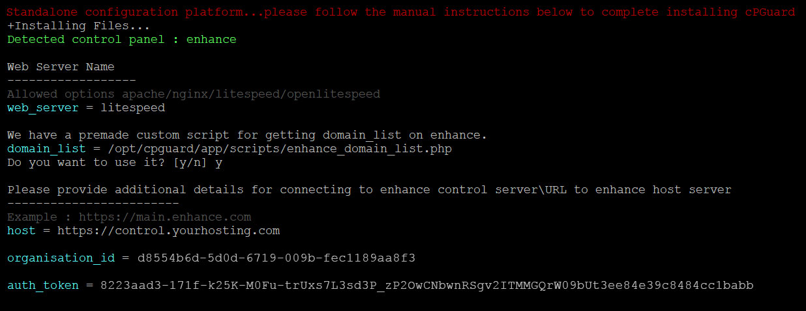

# Installing Enhance Control Panel

This guide will help you install cPGuard standalone version on a server running Enhance control panel. We provide custom scripts designed specifically for Enhance that streamline the installation process by automatically collecting domain information, document root details, and updating your server's Webserver/ModSecurity configuration for Web Application Firewall (WAF) protection.

## Prerequisites

Before you begin the installation, you'll need to gather the following Enhance API credentials:

### Required API Credentials

1. **Control Server URL**
   - Example: `https://control.yourhosting.com`

2. **Organisation ID**
   - Example: `d8554b6d-5d0d-6719-009b-fec1189aa8f3`

3. **Authentication Token**
   - Example: `8223aad3-171f-k25K-M0Fu-trUxs7L3sd3P_3ee84e3…`

:::note
You can provide these credentials during installation or add them to an INI file beforehand to skip prompts. Both approaches will be covered below.
:::

### Creating an Access Token

To obtain your authentication token:

1. Log in to your Enhance control panel
2. Navigate to **Settings > Access Tokens**
3. Click **Create Token**
4. Copy the generated token for use during installation



You can note the token and organisation id to enter it directly when prompted during installation.



## Installation Steps

### Standard Installation (Interactive)

Use the following command to begin the installation process (replace `LICENCE-KEY` with your actual cPGuard license key):

```bash
cd /usr/local/src && rm -f cpguard_install.sh && curl -o cpguard_install.sh -L https://downloads.opsshield.com/cpguard/cpguard_install.sh && bash cpguard_install.sh LICENCE-KEY
```

**Installation Flow:**

1. The script will download and install required dependency packages
2. cPGuard backend and agent services will be installed
3. You'll be prompted to select your webserver type
4. Accept the option to use our custom Enhance scripts for automated domain information collection
5. Enter your Enhance API credentials when prompted:
   - Control server URL
   - Organisation ID
   - Authentication token




6. The installation will complete automatically
7. After successful installation, log in to the cPGuard portal to configure your server

:::success
Once installation is complete, you can access the cPGuard management portal to configure protection rules and monitor your domains.
:::

## Unattended Installation (Non-Interactive)

For automated installations without prompts, you can provide all configuration values in an INI file before running the installation script.

### Creating the Configuration INI File

Create a configuration file with the following parameters:

```ini
host = https://control.yourhosting.com
organisation_id = d8554b6d-5d0d-6719-009b-fec1189aa8f3
auth_token = 8223aad3-171f-k25K-M0Fu-trUxs7L3sd3P_3ee84e3…
```

:::info
Refer to the [cPGuard Standalone Configuration Reference](../../standalone/configuration) for comprehensive details on all available INI file parameters.
:::

### Running Unattended Installation

Execute the installation command with the INI file path as an argument:

```bash
cd /usr/local/src && rm -f cpguard_install.sh && curl -o cpguard_install.sh -L https://downloads.opsshield.com/cpguard/cpguard_install.sh && bash cpguard_install.sh LICENCE-KEY /path/to/config.ini
```

Replace `/path/to/config.ini` with the actual path to your configuration file.

### Bulk Installation

For deploying cPGuard across multiple servers with similar configurations:

1. Install cPGuard on the first server and complete the setup
2. Locate the auto-generated INI file created during installation (contains all Enhance auth tokens)
3. Copy this INI file to additional servers
4. Use the unattended installation command with the copied INI file on each new server

This approach ensures consistent configuration across your infrastructure.

## Next Steps

After successful installation:

1. Access the cPGuard management portal
2. Configure Web Application Firewall rules for your domains
3. Set up security policies and compliance settings
4. Monitor and analyze security events

## Related Documentation

- [cPGuard Standalone Configuration Reference](../../standalone/configuration)
- [How to Modify Standalone Configuration File (cpguard.ini)](../../troubleshooting/modify-standalone-configuration-file)


## Support

If you encounter any issues during installation:

- Check the [cPGuard Knowledge Base](https://www.opsshield.com/help)
- [Raise a Support Ticket](https://manage.opsshield.com/index.php/client/plugin/support_manager/client_tickets/departments/)
- Review the [cPGuard Changelog](https://opsshield.com/changelog/)
