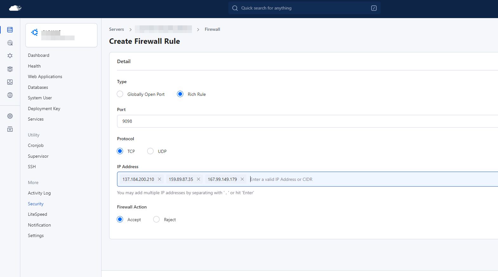

**RunCloud** is a modern, developer-focused server management panel built for web application hosting — from WordPress and Laravel to CodeIgniter, CakePHP, and custom PHP applications. It combines simplicity with power through features like atomic deployments, site authentication, multi-user management, and data backups.

Adding **cPGuard** to a RunCloud server brings malware scanning, WAF protection, and IP-level security to a panel that's otherwise focused on deployment and management rather than active defence.

---

## How cPGuard Protects RunCloud Servers

cPGuard integrates with RunCloud through its **Standalone** configuration pathway and protects the server across multiple layers:

- **Malware Scanner** : continuously monitors website directories for threats
- **Web Application Firewall (WAF)** : blocks web attacks via ModSecurity rules
- **Automatic File Cleanup** : removes injected malicious code from PHP and JS files
- **IP Reputation & Country Blocking** : filters known-bad IPs and geo-targeted traffic
- **Email Notifications** : alerts on detections with daily summary reports

---

## Before You Begin : WAF Prerequisites by Stack

The WAF setup requirements for RunCloud depend on which web server you are using. Review the section that matches your setup before proceeding with installation.

### Nginx Stack (RunCloud Business Plan)

If you are on the **RunCloud Business plan**, ModSecurity with Nginx is available and cPGuard can configure WAF automatically.

:::warning
**Do NOT enable WAF from the RunCloud Web Application Security settings.** RunCloud provides a per-application WAF toggle, but this will conflict with cPGuard's server-wide WAF management.

Instead, **enable WAF from cPGuard Settings** after installation. This applies protection across all websites on the server, not just individual applications.
:::

### Nginx Stack (Non-Business Plan)

If you are **not** on the RunCloud Business plan, ModSecurity is not included and must be installed manually before WAF can be enabled.

Follow the dedicated guide to install ModSecurity for Nginx on your server's OS:

[Install ModSecurity with Nginx on Debian / Ubuntu](../waf/install-modsecurity-nginx-debian-ubuntu)

### OpenLiteSpeed (OLS) Stack

If you are using **OpenLiteSpeed** on RunCloud, you can safely ignore both Nginx ModSecurity notes above. ModSecurity integration for OLS follows a different path and is handled automatically by the cPGuard installer.

---

## WAF Prerequisite Summary

| RunCloud Stack | ModSecurity Required? | Action Required Before Install |
|---|---|---|
| Nginx — Business Plan | ✅ Included | None — but **do not** enable WAF from RunCloud UI |
| Nginx — Non-Business Plan | ❌ Not included | Manually install ModSec for Nginx |
| OpenLiteSpeed (OLS) | ✅ Handled automatically | None |

---

## Step 1 : Install cPGuard on RunCloud

Run the following command on your RunCloud server as root to download and execute the cPGuard installer:

```bash
cd /usr/local/src && rm -f cpguard_install.sh && curl -o cpguard_install.sh -L https://downloads.opsshield.com/cpguard/cpguard_install.sh && bash cpguard_install.sh LICENCE-KEY
```

Replace `LICENCE-KEY` with your actual cPGuard license key from OPSSHIELD.

**What the installer does:**

1. Downloads the latest cPGuard installer script
2. Installs all required dependency packages for your operating system
3. Automatically detects your installed web server (Nginx or OLS) and configures cPGuard accordingly
4. Applies the license key and binds the server to your **cPGuard App Portal** account
5. Displays a success message with the App Portal link for your server

:::note
The license key is **mandatory**. Without it, installation cannot be completed and the server will not appear in the App Portal.
:::

---

## Step 2 : Whitelist App Portal IPs in the RunCloud Firewall

After installation, you must whitelist the cPGuard App Portal IP addresses in the **RunCloud firewall** to allow the App Portal to communicate with the cPGuard agent running on your server (TCP port **9098**).

**App Portal IP addresses to whitelist:**

```
137.184.200.210
159.89.87.35
167.99.149.179
```

**How to add the whitelist rules in RunCloud:**

1. Log in to your **RunCloud** dashboard.
2. Navigate to your **Server → Security → Firewall** settings.
3. Add each of the three IP addresses above, allowing access on **TCP port 9098**.




:::warning
If you skip this step, the cPGuard App Portal will be unable to reach the agent service on your server. You will not be able to manage cPGuard settings, view logs, or run remote actions from the App Portal until these firewall rules are in place.
:::

---

## Step 3 : Enable WAF from cPGuard Settings

Once installation and firewall whitelisting are complete, log in to the App Portal and enable the WAF from within cPGuard, not from RunCloud's own application security settings.

1. Log in to the [cPGuard App Portal](https://app.opsshield.com) using your OPSSHIELD credentials.
2. Open your RunCloud server from the server list.
3. Navigate to **Settings → WAF**.
4. Enable WAF and configure the optional modules as needed.

:::tip
For a full breakdown of WAF options and optional modules (Captcha, Scanner, WebShell, Crawler protection), refer to the [cPGuard WAF Overview](../waf/overview) and [WAF Integration CLI](../waf/cpguard-waf-integration-cli) guides.
:::

---

## Free Installation Assistance

OPSSHIELD offers **free installation assistance** for cPGuard on RunCloud servers. If you'd prefer to have the OPSSHIELD team handle the installation and configuration on your behalf, simply reach out to their support team.

:::note
Free installation assistance **does not include** manual ModSecurity installation for non-Business plan Nginx stacks. This step must be completed before requesting installation assistance.
:::

---

## Installation Checklist

| Step | Task | Status |
|---|---|---|
| Pre-install | Check your RunCloud web server stack (Nginx or OLS) | ☐ |
| Pre-install (Nginx, non-Business) | Manually install ModSecurity for Nginx | ☐ |
| Pre-install (Nginx, Business) | Confirm WAF is **not** enabled in RunCloud App Security | ☐ |
| 1 | Run cPGuard installer with license key | ☐ |
| 2 | Confirm installation success and App Portal server link | ☐ |
| 3 | Whitelist App Portal IPs in RunCloud Firewall (port 9098) | ☐ |
| 4 | Log in to App Portal and verify server appears | ☐ |
| 5 | Enable WAF from cPGuard Settings (not from RunCloud UI) | ☐ |
| 6 | Configure scanner, notifications, and other modules | ☐ |

---

