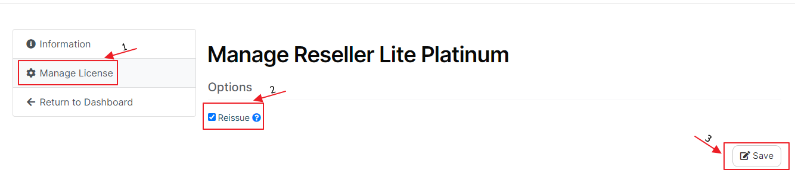

# How to Reissue a cPGuard License

A cPGuard license is tied to the IP address of the server it was activated on. If your server's IP address changes, or you want to move an existing license to a different server, the license must be **reissued** before it can be reactivated. This guide walks through exactly how to do that from the OPSSHIELD client portal.

{/* comment */}

---

## When Do You Need to Reissue a License?

You will need to reissue your cPGuard license in any of the following situations:

- Your server's **IP address has changed** (e.g. after a network reconfiguration or cloud instance replacement)
- You are **migrating cPGuard to a new server** and want to reuse the same license key
- Your license is showing **activation errors** due to an IP mismatch between the key and your current server

:::note
Reissuing does not cancel or reset your subscription — it simply releases the license from its previous IP binding so it can be activated on a new or updated server.
:::

---

## Step-by-Step: How to Reissue a License

### Step 1 : Log In to the OPSSHIELD Client Portal

Go to the OPSSHIELD client portal and log in with your account credentials:

 [https://manage.opsshield.com/index.php/client/login/](https://manage.opsshield.com/index.php/client/login/)

---

### Step 2 : Find Your License Under Services

Once logged in, locate the license key you want to reissue under the **Services** section of your account dashboard.

---

### Step 3 : Open the Service Management Page

Click the **gear icon** (⚙️) corresponding to the license you wish to reissue. This opens the service management page for that specific license.


---

### Step 4 : Reissue the License

From the service management page:

1. Click **"Manage License"** from the left-side menu.
2. Check the **"Reissue"** checkbox.
3. Click the **"Save"** button.



The license is now released from its previous IP binding and is ready to be applied to your new or updated server.


---

### Step 5 : Reapply the License on Your Server

Once reissued, SSH into your server and apply the license key using the following command:

```bash
cpgcli license --key YOUR-LICENSE-KEY
```

Replace `YOUR-LICENSE-KEY` with your actual license key. The key will be verified against the licensing server and your server will be bound to the App Portal again.

:::tip
If you are migrating to a completely new server, make sure cPGuard is already installed before running the license command. Refer to the [Installation guide](../getting-started/installation) if needed.
:::


:::note
If you face more issues to activate the license, please feel free to contact our support team. You can raise a support ticket from within the client portal.
:::

---
