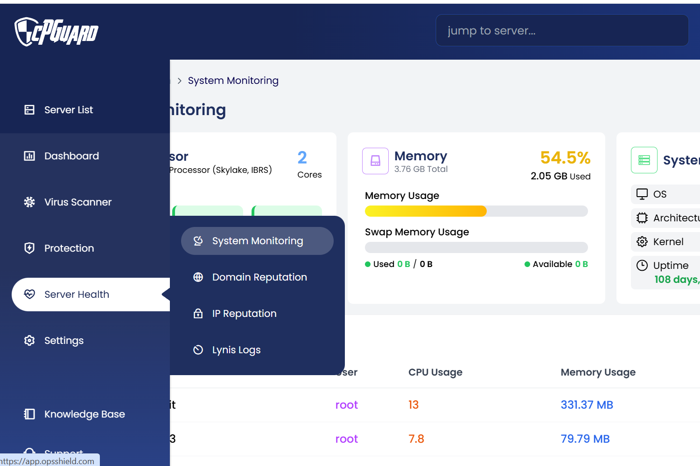
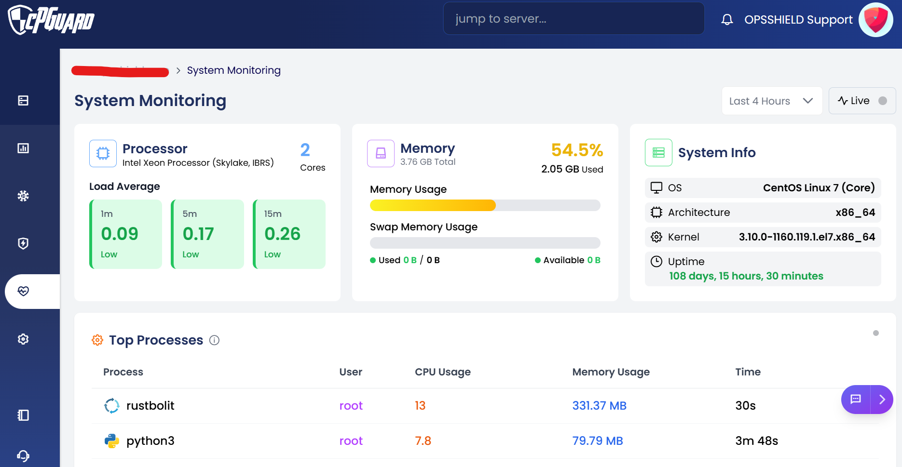
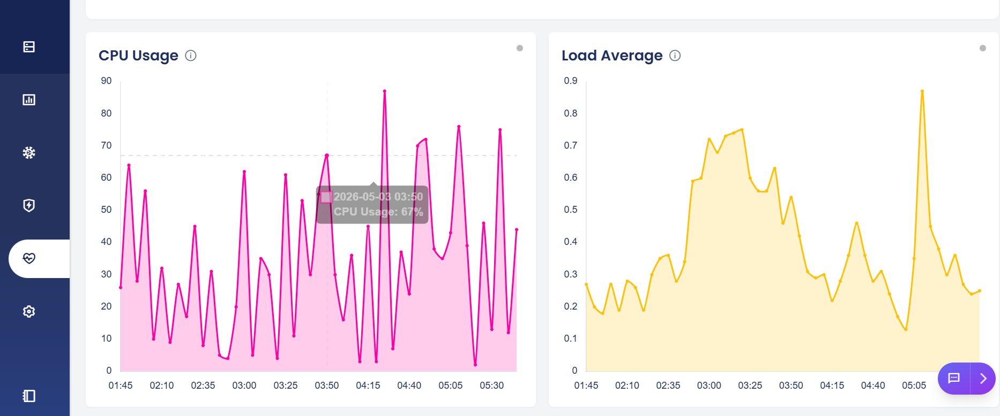
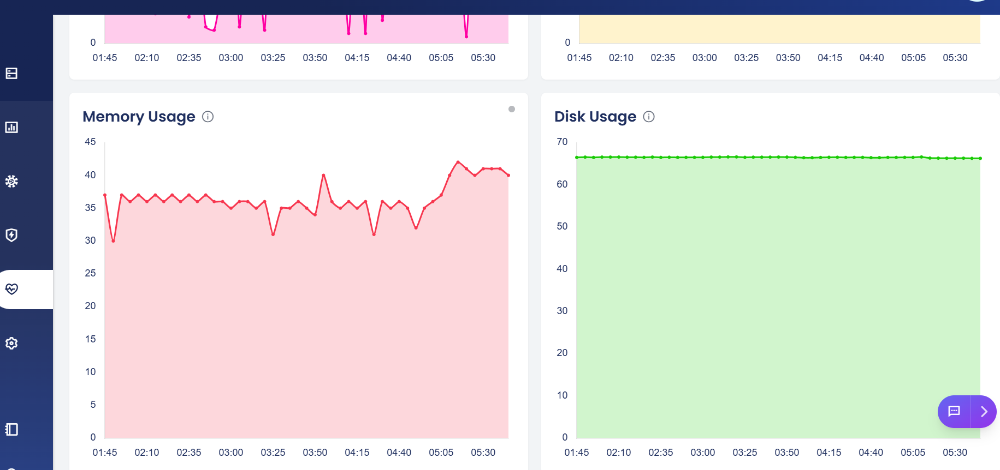
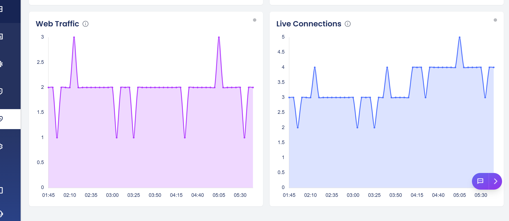

# System Monitoring 

## Overview

The System Monitoring Dashboard provides real-time visibility into server health and performance metrics. It presents live data across CPU, memory, disk, network traffic, and active processes in a unified interface, enabling administrators to detect issues, track trends, and maintain system stability.

> **Navigation:** Dashboard >> Server Health >> System Monitoring

The dashboard supports both live monitoring and historical views. Data can be viewed for the last 1 hour, 4 hours, 12 hours, or 24 hours by selecting the desired duration from the dropdown. To switch to real-time monitoring, simply click the Live button.

---

### 1. Processor

Displays hardware information about the server's CPU along with real-time load averages to indicate how busy the processor is over different time windows.

- Processor model and name
- Number of CPU cores
- Load average over the last 1 minute
- Load average over the last 5 minutes
- Load average over the last 15 minutes
- Status indicator (e.g., Low, Moderate, High) for each load average reading

---

### 2. Memory

Shows how much RAM is currently in use versus what is available, along with swap memory status.

- Total installed memory (RAM)
- Amount of memory currently in use
- Memory usage as a percentage
- Swap memory used
- Swap memory available
- Visual usage bar for quick at-a-glance assessment

---

### 3. System Info

Provides static, read-only information about the server's operating environment and how long it has been running without a restart.

- Operating system name and version
- System architecture
- Kernel version
- Server uptime (days, hours, minutes)

---

### 4. Top Processes

Lists the processes consuming the most CPU and memory resources at any given moment, helping identify runaway or resource-intensive tasks.

- Process name
- User running the process
- CPU usage percentage
- Memory usage (in MB or GB)
- Process runtime duration

---

### 5. CPU Usage Chart

A live time-series graph showing CPU utilization over a rolling 5-minute period, useful for spotting spikes or sustained high usage.

- CPU utilization percentage over time
- 5-minute rolling window
- Real-time updates

---

### 6. Load Average Chart

A time-series visualization of the server's load average, helping administrators understand workload trends beyond the current moment.

- Load average trend over time
- Comparison across 1m, 5m, and 15m intervals

---

### 7. Memory Usage Chart

A graphical view of memory consumption over time, useful for identifying memory leaks or gradual growth in usage.

- Used vs. available memory over time
- Real-time updates

---

### 8. Disk Usage

Shows how much storage space is being used across the server's mounted drives or partitions.

- Disk usage percentage per partition or volume
- Used and available storage space

---

### 9. Web Traffic

Tracks the volume of incoming web requests and the amount of bandwidth being consumed by the server.

- Number of HTTP/HTTPS requests over time
- Bandwidth usage (inbound and outbound)

---

### 10. Live Connections

Displays the number of active network connections to the server at any point in time.

- Total count of live connections
- Real-time updates