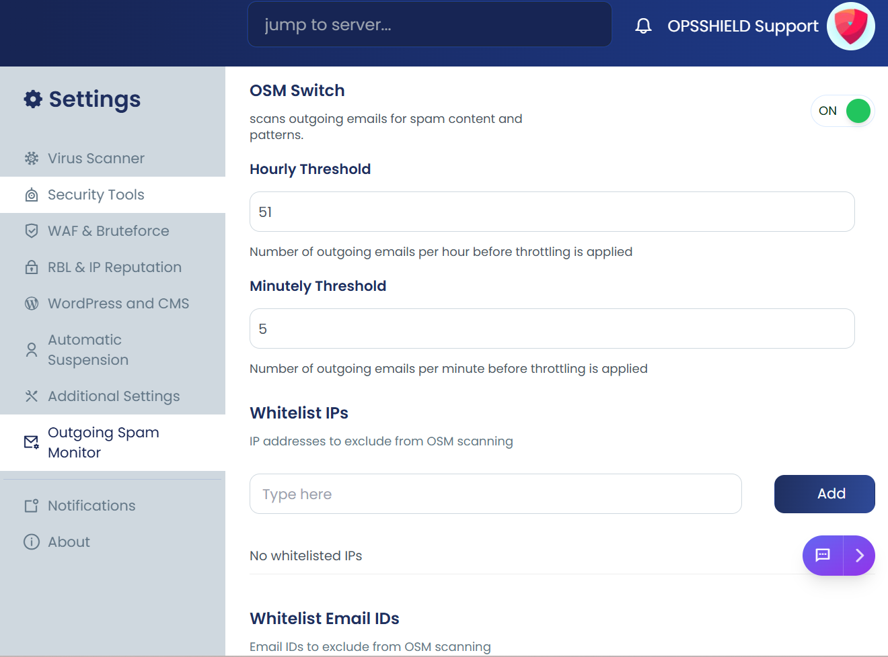
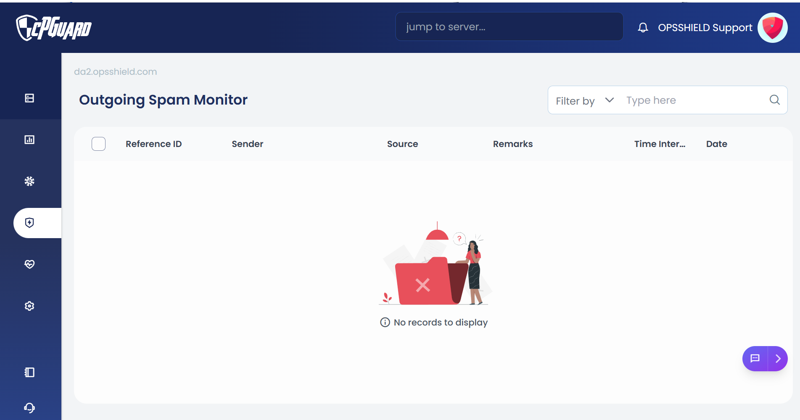

# Outgoing Spam Monitor (OSM)

Outgoing Spam Monitor (OSM) is a security feature designed to detect and prevent spam emails originating from your server.

It continuously monitors outgoing email activity and helps identify:

- Compromised email accounts
- Malicious scripts sending spam
- Unusual email sending patterns

By proactively detecting such behavior, OSM helps protect your server from:

- Email abuse
- IP blacklisting
- Reputation damage

## Control Panels Support cPGuard OSM

- cPanel
- DirectAdmin
- Webuzo

## How to Enable OSM

By default, OSM is disabled.

To enable it go to:

**App Portal → Settings → Outgoing Spam Monitor → Enable OSM switch**

Once enabled, OSM will start monitoring outgoing email activity in real-time.

## Viewing OSM Logs

You can easily monitor Outgoing Spam Monitor (OSM) activity and review any detections by navigating to:

**Protection → OSM**

Here, you will find detailed logs showing which users or domains triggered thresholds, along with timestamps and email counts, source, helping you quickly investigate and respond to potential spam activity.

## OSM Configuration Options

Below are the most important OSM settings typically available:

### Hourly Threshold

The Hourly Threshold helps protect your server's reputation by limiting the number of emails that can be sent within one hour. This is especially useful to quickly detect and stop compromised accounts sending bulk spam.

The Hourly Threshold defines the maximum number of emails allowed per hour per email address or CWD path.

If the limit is exceeded, alerts are triggered to notify administrators and details are logged in the OSM logs for review.

### Minutely Threshold

The Minutely Threshold helps protect your server by limiting the maximum number of emails a domain can send in a single minute. This is useful to quickly catch rapid bursts of outgoing spam before they escalate.

It is useful for detecting:

- Sudden bursts of spam
- Script-based mailers
- Compromised plugins sending mass emails instantly

Minutely limits stop attacks much faster than hourly limits.

### Whitelist IPs

Allows specific IP addresses to bypass OSM checks.

Use cases:

- Trusted external mail servers
- API-based transactional email systems
- Internal monitoring systems

This prevents legitimate services from being blocked.

### Whitelist Email IDs

Allows specific sender email addresses to bypass spam monitoring rules.

Common examples:

- `noreply@yourdomain.com`
- `billing@yourdomain.com`
- `support@yourdomain.com`

Useful for protecting critical system emails from accidental blocking.

### Whitelist CWD Prefixes

CWD (Current Working Directory) prefix whitelisting allows you to exclude specific application paths from OSM restrictions.

For example:

- `/home/user/public_html/whmcs/`
- `/home/user/app/cron/`

This is helpful for:

- Billing systems
- CRM platforms
- Trusted custom applications

### Spam Patterns

This setting checks only the email subject line for known spam keywords or patterns.

Example:

- Subject: `"Congratulations! You won a prize"` → flagged (contains common spam keywords like "won", "prize")
- Subject: `"Limited time offer – Buy now"` → flagged (contains "offer", "buy now")
- Subject: `"Meeting scheduled for tomorrow"` → not flagged (normal subject, no spam pattern)

This way, only the subject line is analyzed—not the full email content.