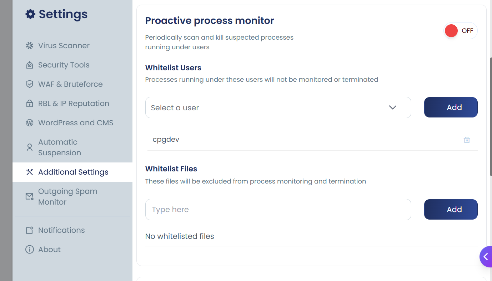
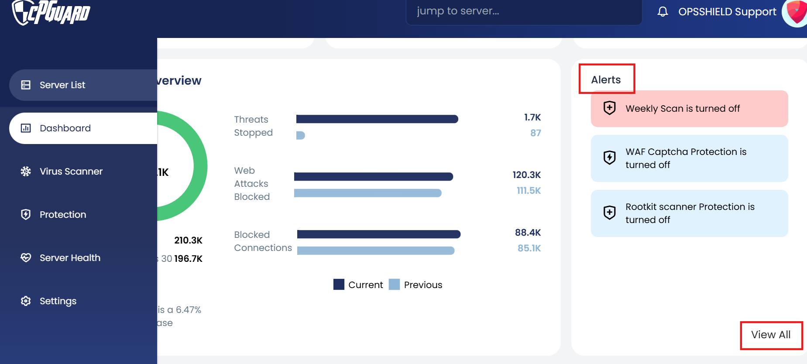
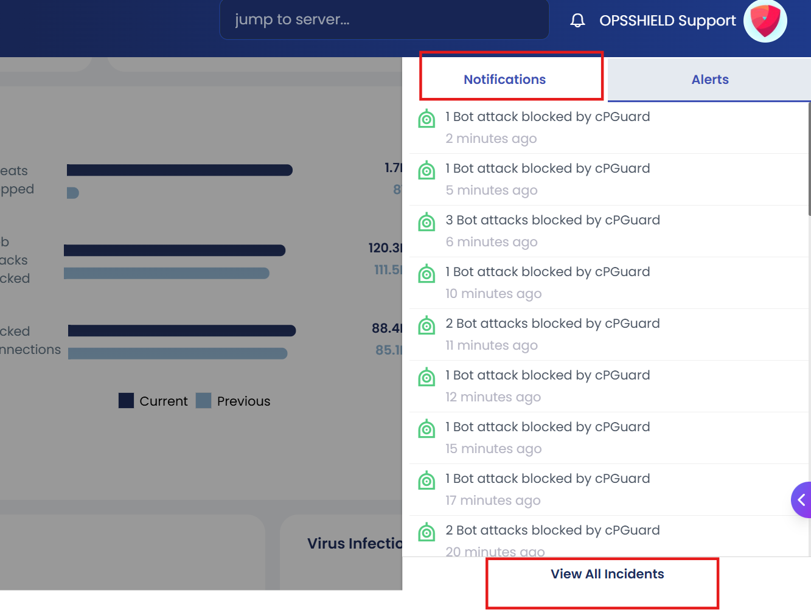
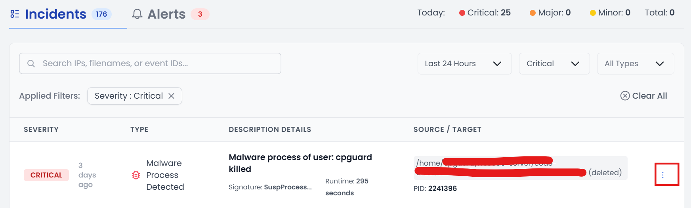
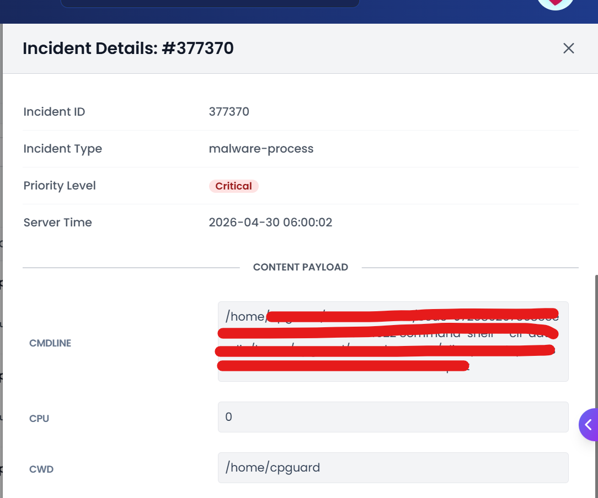

The **Proactive Process Monitor** periodically scans and kills suspected processes running under users on the server.

> You can enable or disable this feature from:
> **Settings > Additional Settings > Proactive Process Monitor**



---

## Should You Be Worried?

**No.** In most cases, suspicious processes are already terminated automatically if you have enabled suspicious process tracking in the settings. You may safely ignore this alert, as the process was already killed.

> **Note:** It's not PHP itself that is infected — rather, a PHP script triggered suspicious behavior, which raised this alert.

---

## Enable / Disable

```bash
# Enable Process Monitor
cpgcli process-monitor --enable

# Disable Process Monitor
cpgcli process-monitor --disable
```

---

## Whitelist Users

Processes running under whitelisted users will **not** be monitored or terminated.

```bash
# List all whitelisted users
cpgcli process-monitor --whitelist-users --list

# Add a user to the whitelist
cpgcli process-monitor --whitelist-users --add cpgdev

# Remove a user from the whitelist
cpgcli process-monitor --whitelist-users --remove cpgdev
```

---

## Whitelist Files / Processes

Specific files or processes can be excluded from monitoring by whitelisting their path or command line string. Any process whose path or command line **contains** the whitelisted string will be skipped.

```bash
# List all whitelisted process identifiers
cpgcli process-monitor --whitelist --list

# Add a process path or command line string to the whitelist
cpgcli process-monitor --whitelist --add /usr/bin/example

# Remove a process path or command line string from the whitelist
cpgcli process-monitor --whitelist --remove /usr/bin/example
```

---


## How to View More Details

To get more information about the alert, follow these steps in your dashboard:

1. Go to the **Alerts** section
2. Click **View All**




3. Click on **Notifications**
4. Select **View Incidents**



5. You will see the related alert: *Suspicious Process Detected and Killed*



6. Click the **three dots (⋮)** next to the incident to view full details



---

## Incident Details Explained

When you open an incident, you will see the following fields:

| Field            | Description                                                                 |
|------------------|-----------------------------------------------------------------------------|
| **Incident ID**  | Unique identifier for the alert                                             |
| **Incident Type**| Type of threat detected (e.g., malware-process)                            |
| **Priority Level**| Severity of the alert (e.g., Critical)                                    |
| **Server Time**  | Date and time the incident was detected                                     |
| **Content Payload** | Raw details of the flagged process                                       |
| **CMDLINE**      | The exact command that was running when the process was flagged             |
| **CPU**          | CPU usage of the process at the time of detection                          |
| **CWD**          | Current working directory where the process was running                    |

---

This alert is informational. Your security system detected and terminated the process automatically. No further action is required unless the same alert keeps recurring.

