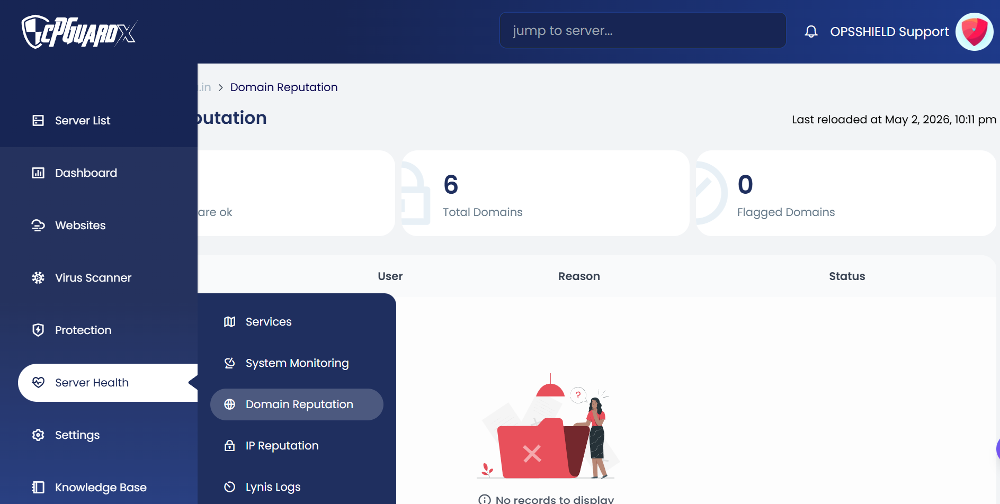
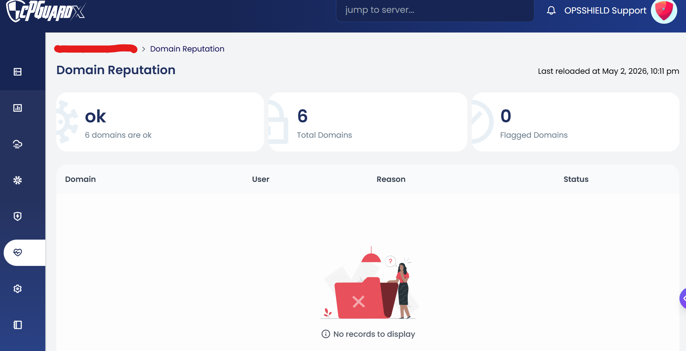

Domain Reputation monitoring is used to check the health of domains against major blacklists, in case a website has been flagged by search engines or users as malicious or unsafe. This feature helps administrators proactively monitor domain reputation and take action before it impacts end users.

> **Navigation:** App Portal >> Server Health >> Domain Reputation

If any domain is flagged under this section, checking the domain in a browser will most likely display a warning as well.

---

#### How It Works

- Domain reputation is checked against **Google Safe Browsing** database
- It monitors all domains hosted on the server
- The system automatically checks domain reputation at scheduled intervals
- Any resolved issues will be cleared from the Domain Reputation page after the next scheduled scan on the server

> **Note:** Domain reputation checks cannot be triggered manually. The scan is scheduled to run automatically in order to manage distributed load and to use the API efficiently.

---

#### Dashboard Summary

The Domain Reputation page displays a summary at the top, showing the last reloaded time along with the following counters:

- **Total Domains** — Total number of domains hosted on the server that are being monitored
- **Flagged Domains** — Number of domains currently blacklisted or flagged

---

#### Domain List

The domain list table displays the details of flagged domains with the following columns:

- **Domain** — The domain name that has been flagged
- **User** — The user account associated with the domain
- **Reason** — The reason the domain has been flagged
- **Status** — The current status of the domain

> As long as there are no blacklisted domains, the list will remain empty and display **"No data found"**.

---

#### Important Notes

- cPGuard refers only to the **Google Safe Browsing** database for domain reputation checks
- This feature covers all domains hosted on the server
- If a domain is flagged, it is recommended to investigate and resolve the issue promptly, as flagged domains may show browser warnings to visitors
- Once the issue is resolved, the domain will be cleared automatically after the next scheduled scan