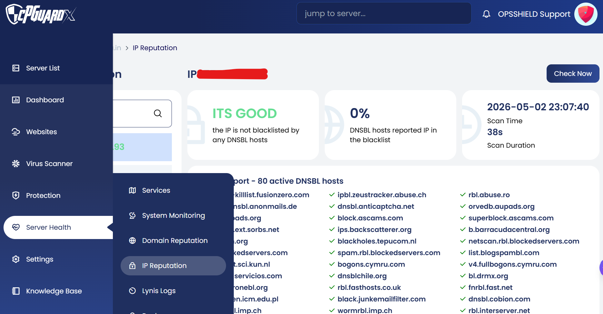
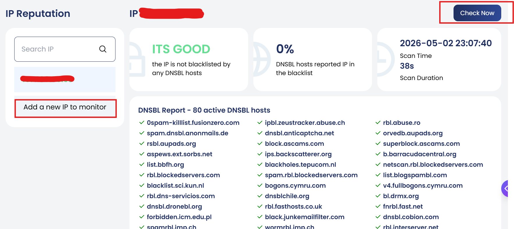

> **Navigation:** App Portal >> Server Health >> IP Reputation

The IP Reputation feature helps administrators proactively monitor server IP addresses against a listed set of DNS-based Blacklists (RBLs). This is especially useful for ensuring outgoing email deliverability and maintaining the reputation of the server's IP addresses.

When a blacklisted IP is detected, a notification is sent to the configured admin email.

---

#### How It Works

- cPGuard performs daily DNS-based blacklist (RBL) checks on the server IPs
- It checks the IP against **80 active DNSBL hosts**
- When a listing is found, a notification is sent to the configured admin email
- Since checks run on a schedule (once per day), there may be a delay between when an IP gets blacklisted and when the alert is received
- If the blacklist is not part of the DNSBL sources cPGuard monitors — such as web reputation or traffic-based lists — it may not be detected

> **Recommendation:** Verify that the feature is enabled, the correct IPs are being monitored, and that notification settings are properly configured to ensure timely alerts.

---

#### Adding an IP to Monitor

- Enter the IP address into the input box
- Press the **Enter** key on the keyboard to trigger the IP reputation check
- If no IP is selected, the list will display **"No selected item"**
- Once an IP is added, simply click on it from the list to view its latest scan results directly, or use the **Check Now** button to trigger a fresh scan

---

#### Scan Results

Once a check is completed, the following details are displayed:

- **Status** — Indicates whether the IP is blacklisted or clean (e.g., "The IP is not blacklisted by any DNSBL hosts")
- **DNSBL Hosts Reported** — Percentage of DNSBL hosts that have reported the IP in the blacklist
- **Scan Time** — The date and time the scan was last performed
- **Scan Duration** — The time taken to complete the scan

---

#### DNSBL Report

The DNSBL Report section shows the result of the IP check against all active DNSBL hosts. It displays:

- Total number of active DNSBL hosts checked
- Which hosts have flagged the IP (if any)
- Overall blacklist status of the IP

---

