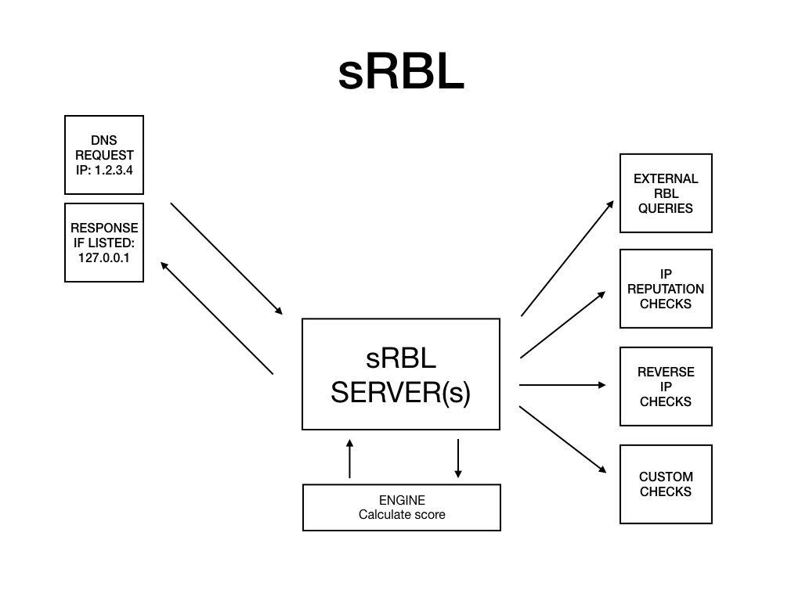
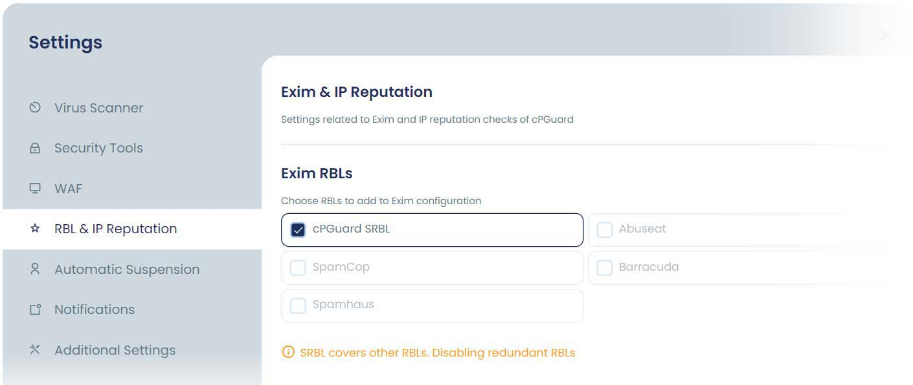

# How cPGuard SRBL Works with Exim

## Overview
cPGuard SRBL (Spam Real-time Blackhole List) is an advanced spam filtering mechanism that integrates with the Exim mail server. It enhances email security by checking incoming email sender IP addresses against multiple RBL databases and intelligently blocking spam before it reaches the server.

This feature helps reduce unwanted emails and improves server performance by filtering spam at an early stage.

## How SRBL Works

The SRBL system in cPGuard operates as follows:

1. When an incoming email is received, Exim extracts the sender's IP address.
2. The IP address is checked against multiple RBL (Real-time Blackhole List) databases.
3. These may include:
   - Abuseat
   - Barracuda
   - SpamEatMonkey
   - cPGuard SRBL (in-house engine)
4. Based on the results, the system determines whether the sender is trusted or flagged.
5. If the IP is listed in any blacklist, the email is rejected or blocked.
6. If the IP passes all checks, the email is accepted and processed normally.

## Key Features

- Multi-RBL integration for enhanced spam detection
- In-house SRBL engine for improved accuracy
- Early-stage spam filtering (before mail queue processing)
- Reduced server load and improved performance
- Seamless integration with Exim

## Prerequisites

- cPGuard installed and configured
- Exim mail server running
- Root or administrative access to the server

## Enable or Disable cPGuard SRBL

Follow these steps:

1. Log in to your server control panel.
2. Navigate to:
   cPGuard >> Settings >> RBL & IP Reputation
3. Locate the "Exim RBLs" section.
4. Enable or disable:
   - cPGuard SRBL
   - Other RBL providers
5. Save the changes.

## Notes / Best Practices

- Keep SRBL enabled for better spam protection.
- Use multiple RBLs for improved accuracy.
- Monitor mail logs regularly to identify false positives.
- Whitelist trusted IPs when necessary.

## Troubleshooting

### Emails Getting Blocked Incorrectly
- Verify if the sender IP is listed in RBL databases.
- Whitelist the sender IP if required.

### SRBL Not Working
- Ensure Exim is running correctly.
- Verify cPGuard services status.
- Check logs for errors.

### High False Positives
- Disable specific RBL providers temporarily.
- Adjust whitelist settings.

## Conclusion

cPGuard SRBL integration with Exim provides an effective way to block spam at the source. With proper configuration and monitoring, it helps maintain a secure and efficient email environment.
