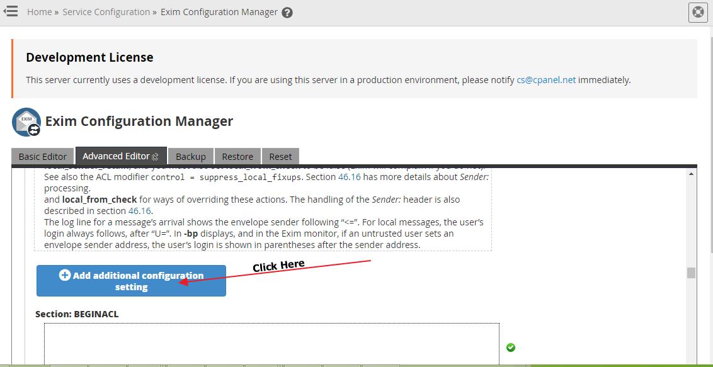
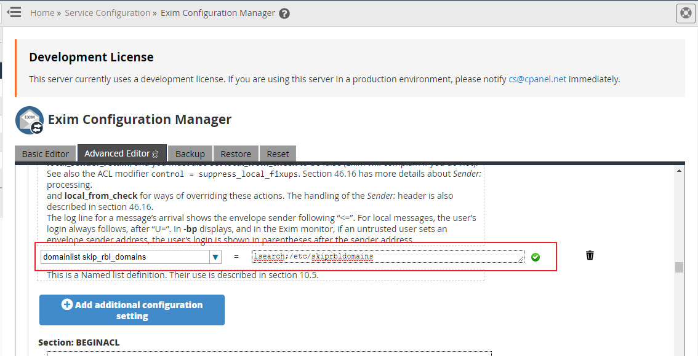
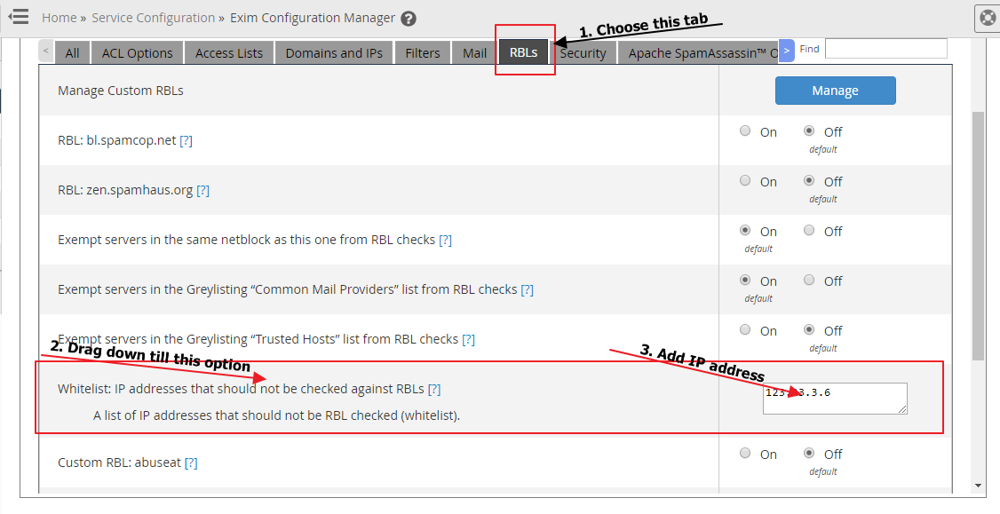

# SRBL – How to Whitelist a Domain or Sender IP Address in cPGuard

The cPGuard **sRBL (Sender Real-time Blacklist)** engine is built to block incoming mail from known spam and malicious sources with near-zero false positives. However, there are legitimate scenarios where you may need to exempt a specific local domain or a trusted sender IP address from RBL checking — for example, when a known partner's mail server has an unusual reputation score, or when a local sending domain is being incorrectly flagged.

This guide explains how to whitelist both domains and sender IP addresses across **cPanel/WHM** and **DirectAdmin** environments.

{/* comment */}

---

## What Is the cPGuard sRBL?

The cPGuard sRBL is a mail-layer security feature that checks incoming email sender IP addresses against Real-time Blackhole Lists (RBLs) — databases of IP addresses known to send spam or malicious email. If a sending IP is found in any of the configured RBL databases, the incoming mail is rejected before it reaches the mailbox.

Whitelisting tells the RBL check to skip specific domains or IP addresses entirely — ensuring that legitimate mail from trusted sources is never rejected by cPGuard's RBL enforcement.

---

## cPanel / WHM

### Whitelist a Local Domain

Whitelisting a domain prevents the RBL check from firing for email sent from or associated with that domain.

**Step 1 : Create the skip list file**

Log in to your server as root via SSH and create (or edit) the domain skip list file:

```bash
nano /etc/skiprbldomains
```

Add each domain you want to whitelist on a **separate line**, for example:

```
trustedpartner.com
internaldomain.net
```

Save and close the file.

**Step 2 : Open the Exim Configuration Manager in WHM**

1. Log in to **WHM**.
2. Navigate to **Exim Configuration Manager**.
3. Select the **Advanced Editor** tab.

**Step 3 : Add the Domain List Configuration**

1. Scroll to the **"Add Additional Configuration"** section and click the button to add a new entry.


2. In the menu/label field, enter:
   ```
   domainlist skip_rbl_domains
   ```
3. In the text box, enter:
   ```
   lsearch;/etc/skiprbldomains
   ```
4. Click the **Save** button at the bottom of the interface.

Exim will now skip RBL checks for any domain listed in `/etc/skiprbldomains`.




:::tip
To add more domains in the future, simply add new lines to `/etc/skiprbldomains`. No changes to the Exim configuration are needed after the initial setup.
:::

---

### Whitelist a Sender IP Address

Whitelisting a sender IP address tells Exim to skip RBL checks for email arriving from that specific IP.

**Steps:**

1. Log in to **WHM**.
2. Navigate to **Exim Configuration Manager**.
3. Click the **RBLs** tab.
4. Scroll down and locate the option labelled:
   **"Whitelist: IP addresses that should not be checked against RBLs"**
5. Enter the IP address (or addresses) you want to whitelist.
6. Save your changes.



:::note
For full details on the WHM RBL whitelist interface and its available options, refer to the official cPanel documentation:
 [cPanel RBL Documentation](https://documentation.cpanel.net/display/1146Docs/RBLs#RBLs-Whitelist:IPaddressesthatshouldnotbecheckedagainstRBLs)
:::

---

## DirectAdmin

For **DirectAdmin** servers, the process for exempting a domain from Exim's RBL blocking follows DirectAdmin's own configuration pathway.

Refer to the official DirectAdmin documentation for step-by-step instructions:

[How to omit a domain from Exim's RBL blocking – DirectAdmin Docs](https://docs.directadmin.com/other-hosting-services/preventing-spam/incoming-spam.html#how-to-omit-a-domain-from-exim-s-rbl-blocking)

---


## When Should You Whitelist?

:::warning
Whitelisting should be used sparingly and only for genuinely trusted sources. Adding IPs or domains to the whitelist removes a layer of protection for emails from those senders. Always verify that a sender is legitimate before whitelisting.
:::

Common legitimate reasons to whitelist:

- A trusted business partner's mail server has an unusual or outdated IP reputation
- An internal relay server or application sending domain is being blocked
- A bulk email service used by your organisation has IPs that appear in third-party RBLs
- A known newsletter provider used by your users is being rejected

---

