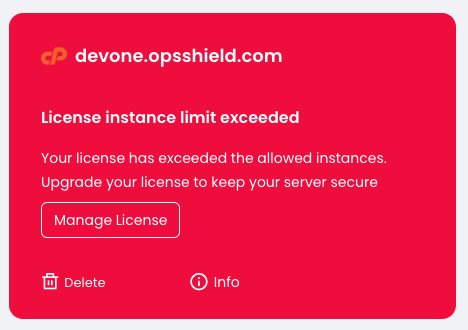

The **"Allowed Accounts Limit Exceeded "** or **"License instance limit exceeded"** error typically appears on servers using a **Standard License** when the number of users on the server exceeds the permitted limit.



cPGuard offers two license types:

- **Standard License** – Valid for up to **50 users** on a server.
- **Unlimited License** – No limit on the number of users.

Since cPGuard supports multiple hosting control panels and platforms, the user count is determined based on the number of **normal system users** present on the server, regardless of the number of users shown in the hosting control panel.

## How to Resolve the Error

You can resolve this issue using one of the following methods:

### Option 1: Reduce the User Count

List the users on the server and remove any unwanted or inactive users to bring the total user count below **50**.

### Option 2: Upgrade to an Unlimited License

Purchase and apply an **Unlimited License** to the server. Once the new license is active, you may cancel the existing Standard License.

> **Note:** There is currently no direct upgrade path from a Standard License to an Unlimited License. A new Unlimited License must be purchased and applied separately.

## How User Count Is Calculated

To determine the number of users on your server, run the following command:

```bash
/usr/bin/awk -F '[/:]' '{if ($3 >= 1000 && $3 < 60000 && $3 != 65534) print $1}' '/etc/passwd' | grep -v 'cpguard\|centos\|clamav\|magicspam\|cldiaguser\|ubuntu\|cyberpanel\|docker\|ftpuser\|lscpd' 2>&1 | /usr/bin/wc -l
```

## View the List of Counted Users

To display the users included in the license count, run:

```bash
/usr/bin/awk -F '[/:]' '{if ($3 >= 1000 && $3 < 60000 && $3 != 65534) print $1}' '/etc/passwd' | grep -v 'cpguard\|centos\|clamav\|magicspam\|cldiaguser\|ubuntu\|cyberpanel\|docker\|ftpuser\|lscpd'
```

## Need Assistance?

If you need any assistance resolving this issue, please feel free to contact our support team.