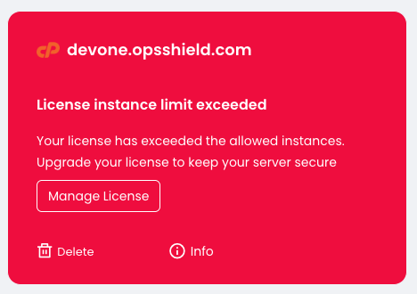

The **"Allowed Accounts Limit Exceeded "** or **"License instance limit exceeded"** error typically appears on servers using a **Standard License** when the number of users on the server exceeds the permitted limit.



cPGuard offers multiple license plans based on the number of user accounts protected on a server:

* **Starter** – Up to **10 user accounts**
* **Small Business** – Up to **50 user accounts**
* **Growth** – Up to **250 user accounts**
* **Unlimited** – No limit on the number of protected user accounts

The user count is based on the **user accounts protected by cPGuard** in the server.

## How to Resolve the User Limit Error

If the number of protected users exceeds the limit of your current license, you can upgrade to a plan that supports the required number of users.

You can contact our support team to request a **license plan upgrade**. 

## How User Count Is Calculated

cPGuard counts the user accounts that are currently protected by cPGuard for the purpose of license usage.

To view the users currently counted by cPGuard, run:

```bash
cpgcli license --list-users
```

This command displays the user details that cPGuard is currently counting toward the license limit.

Use this command to verify the current protected-user count before contacting support regarding a license limit.

## Need Assistance?

If you need any assistance resolving this issue, please feel free to contact our support team.