The cPGuard user plugin allows end users to **run scans against their own files** and view **attack statistics for their websites** — and tracking attack statistics including virus infections, CMS threats, WAF events, and bot activity.

cPGuard is available as a user-level plugin across **cPanel**, **DirectAdmin**, and **Webuzo**. This document covers how to access and use the cPGuard plugin from the end-user perspective on each control panel.

---

## Accessing cPGuard

### cPanel

1. Log in to **WHM** as root or reseller.
2. Go to **List Accounts** and select the desired user.
3. Navigate to **Security → cPGuard**.

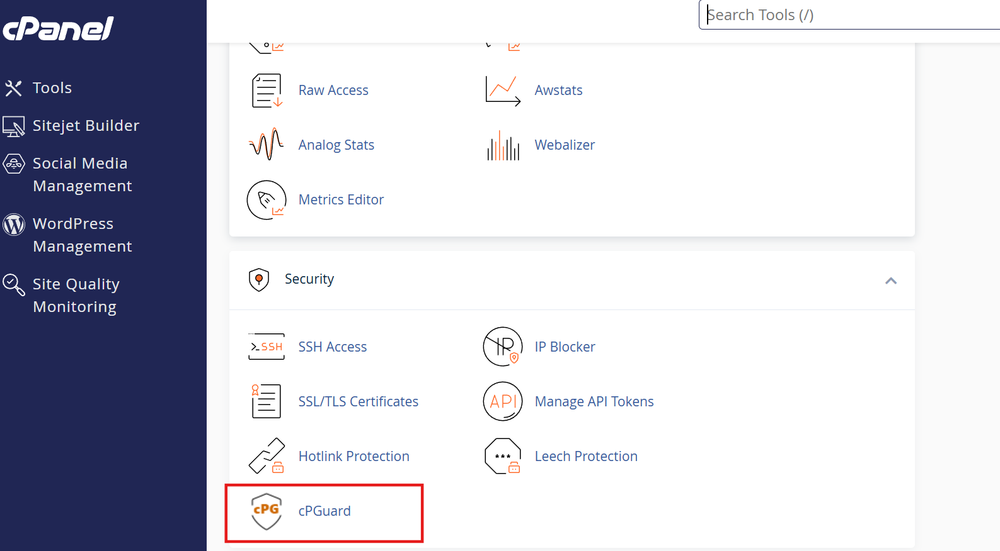

### DirectAdmin

1. Log in as the user.
2. Go to **Extra Features → cPGuard**.

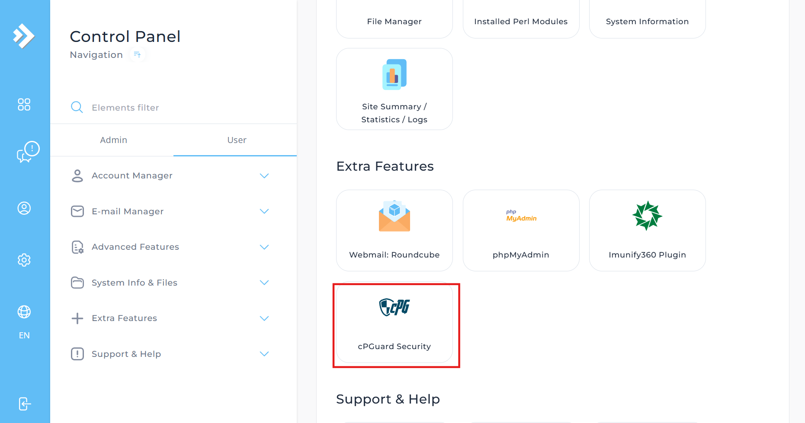

### Webuzo

1. Log in to the **End User Panel**.
2. Go to **Security → cPGuard**.

---

## Dashboard

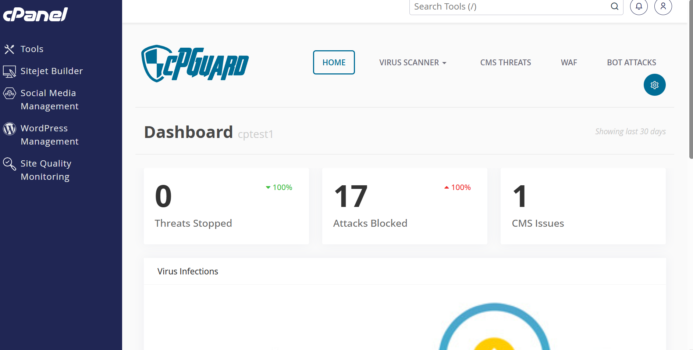

Once inside cPGuard, the **Dashboard** gives a summary of activity for the last 30 days.

| Metric | Description |
|---|---|
| **Threats Stopped** | Total threats detected and stopped |
| **Attacks Blocked** | Number of attacks blocked (e.g., WAF/BOT) |
| **CMS Issues** | Issues detected in CMS installations |
| **Virus Infections** | Malware/virus files detected |

> **Example view (cPanel user: cptest1):**
> - Threats Stopped: `0` (100%)
> - Attacks Blocked: `17` (100%)
> - CMS Issues: `1`

---

## Navigation Menu

| Section | Description |
|---|---|
| **Home** | Dashboard overview |
| **Virus Scanner** | Manual scanner and scanner logs |
| **CMS Threats** | CMS-related threat reports |
| **WAF** | Web Application Firewall logs |
| **BOT Attacks** | Bot attack logs and reports |

---

## Virus Scanner

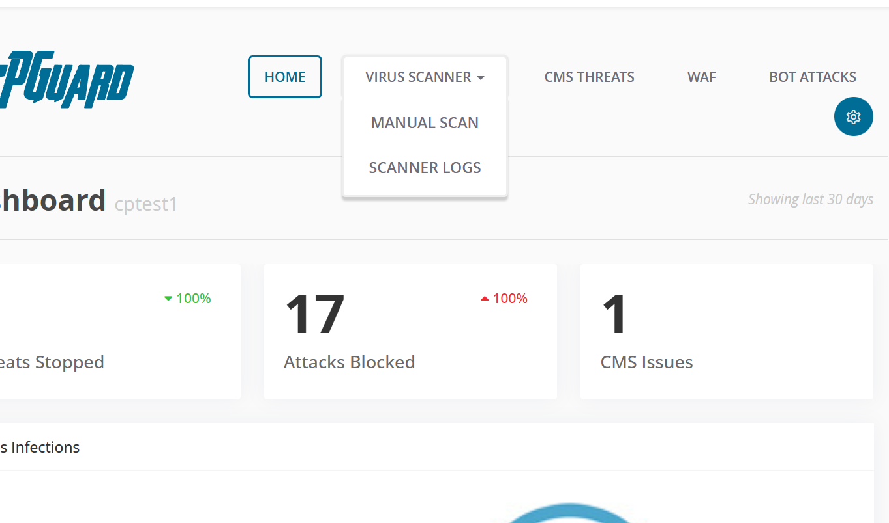
### Manual Scanner

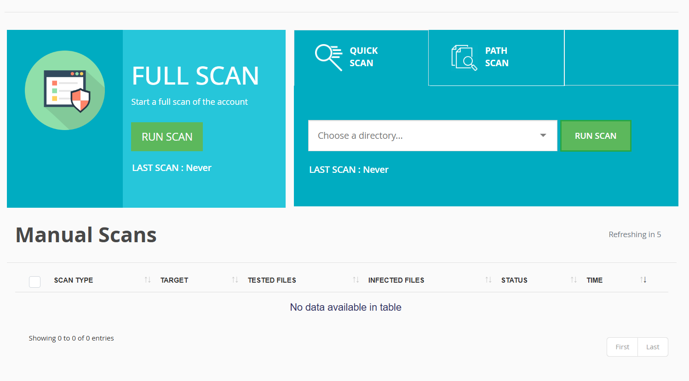

- Allows the user to **initiate an on-demand scan** of their account files.
- Useful for scanning specific directories or the entire home directory.

### Scanner Logs

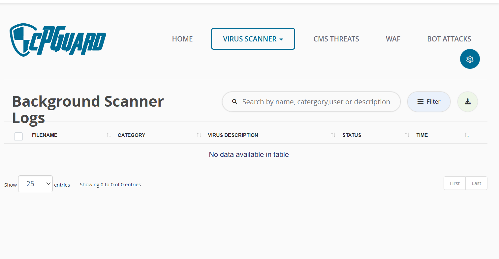

- Displays logs from **background/scheduled scans** run by the system.
- Users can review past scan results, detected files, and actions taken.

---

## Settings

> **Note:** Settings configured here apply **only to manual scans initiated by the user** from within their panel.

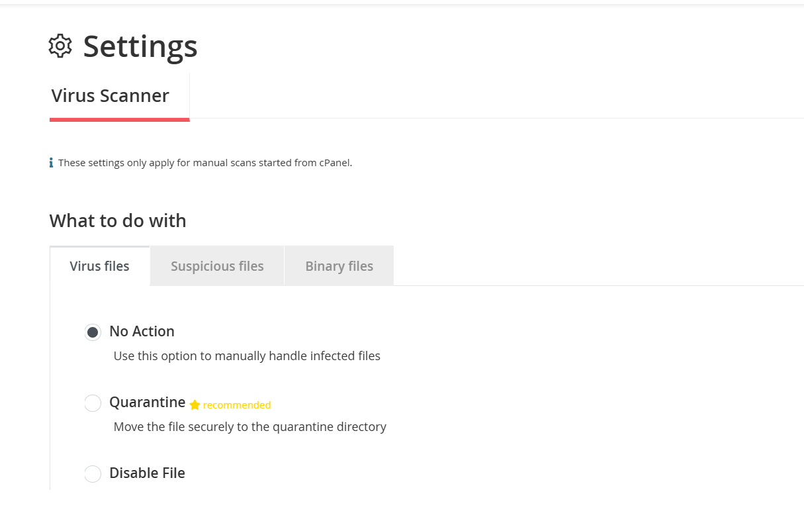

### What to Do With Detected Files

| File Type | Options Available |
|---|---|
| **Virus Files** | No Action / Quarantine / Disable File |
| **Suspicious Files** | No Action / Quarantine / Disable File |
| **Binary Files** | No Action / Quarantine / Disable File |

### Action Descriptions

| Action | Description |
|---|---|
| **No Action** | No automatic action taken. Use this to manually handle infected files. |
| **Quarantine** *(Recommended)* | Moves the file securely to the quarantine directory. |
| **Disable File** | Sets file permissions to `000`, making the file inaccessible. |

---

### Whitelist Files

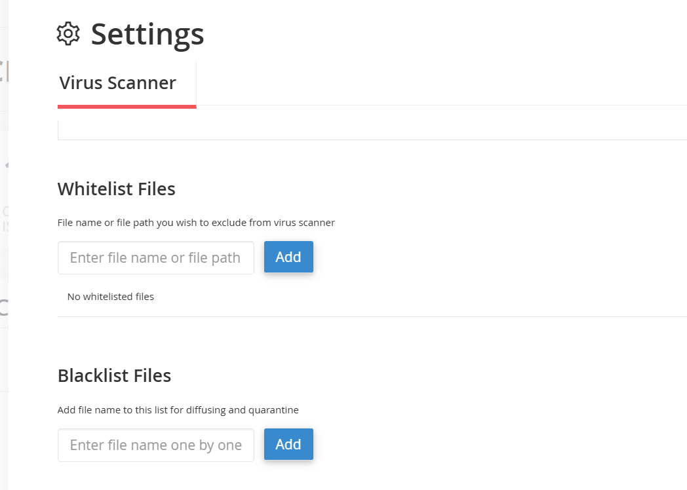

Exclude specific files or paths from being flagged by the virus scanner.

- Enter a **file name** or **full file path** to whitelist.
- Whitelisted files will be skipped during scans.

> *No whitelisted files by default.*

---

### Blacklist Files

Force specific files to be flagged and acted upon during scans.

- Add a **file name** to this list to ensure it is always diffused or quarantined.

> *No blacklisted files by default.*

---

## ⚠️ Important — Root-Level vs User-Level Settings

:::danger 
Please note that the settings configured at the root level in cPGuard (i.e., via the app portal) are completely independent from the user plugin settings.

User plugin settings will not be reflected in the app portal interface. They will only apply within the user plugin.
:::

:::info

> - If the **root/admin** has configured the scanner to **Quarantine** files, those settings apply to all **admin-initiated or server-wide scans**.
> - If a **user** changes their personal scan preferences (e.g., No Action or Disable), those settings **only apply when the user manually runs a scan** from their own interface.
> - **Root-level configuration always takes precedence for admin-initiated scans**, regardless of what the individual user has configured.
> - **Automatic scans refer to admin-level settings** and are not affected by anything configured in the user plugin.

| Scan Initiated By | Settings Applied |
|---|---|
| Root / Admin | Root-level cPGuard settings |
| User (manual scan) | User-level settings only |

:::
---

## CMS Threats

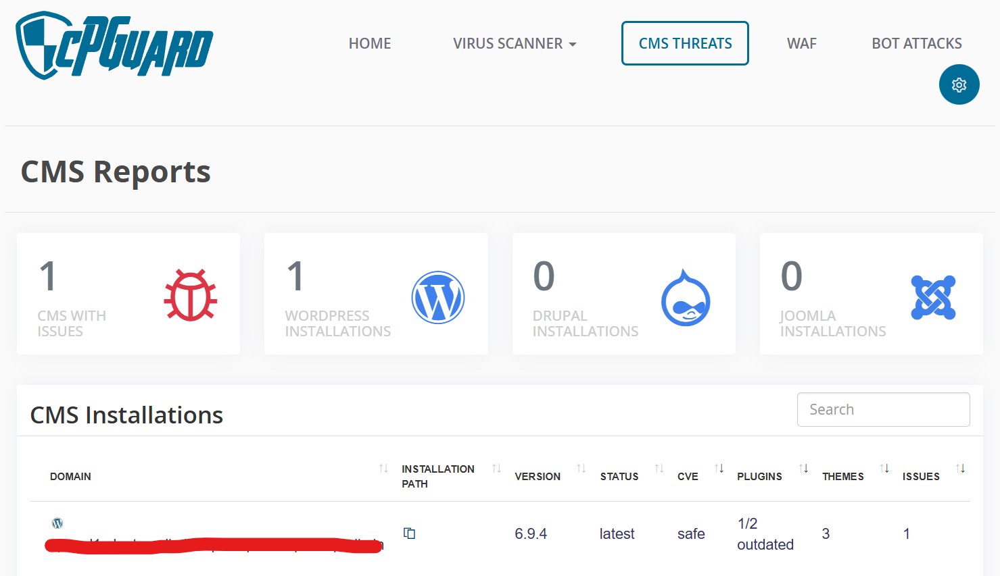 

Displays issues detected in CMS installations (e.g., WordPress, Joomla) on the user's account. Reports include threat type, affected file, and detection time.

---

## WAF (Web Application Firewall)

Shows logs of requests blocked by the Web Application Firewall — including blocked IPs, request details, and matched rules.

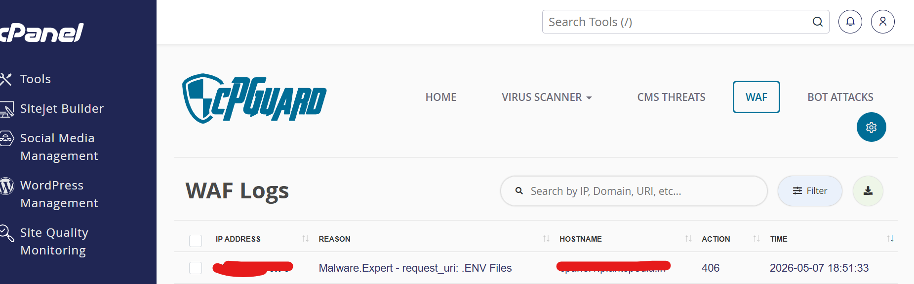
---

## BOT Attacks

Displays logs of automated bot traffic that has been detected and blocked. Useful for identifying patterns and sources of malicious activity.

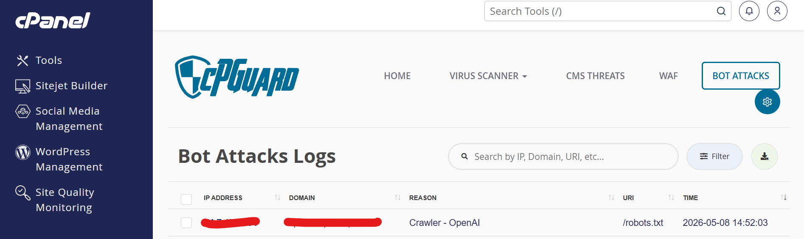
---

