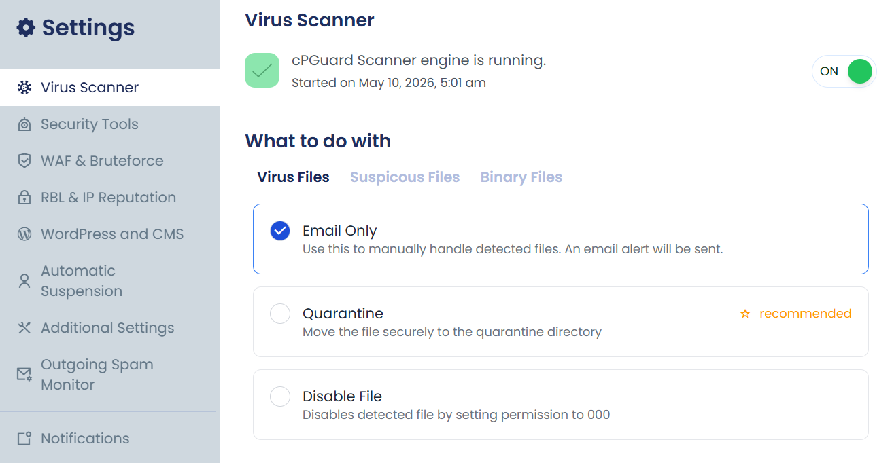
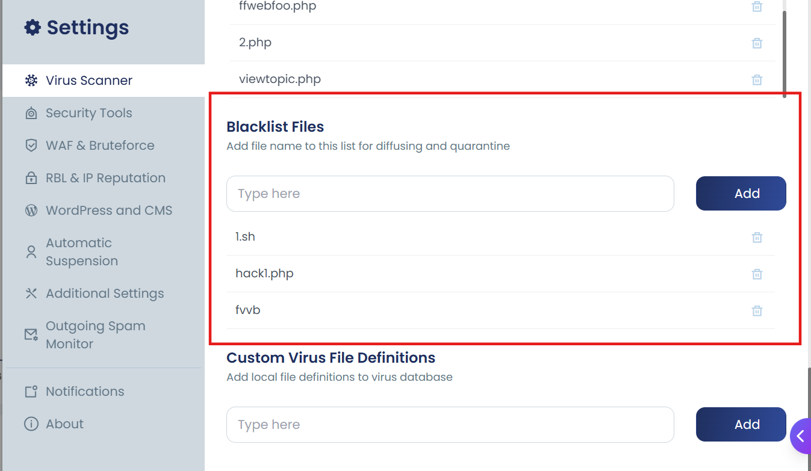
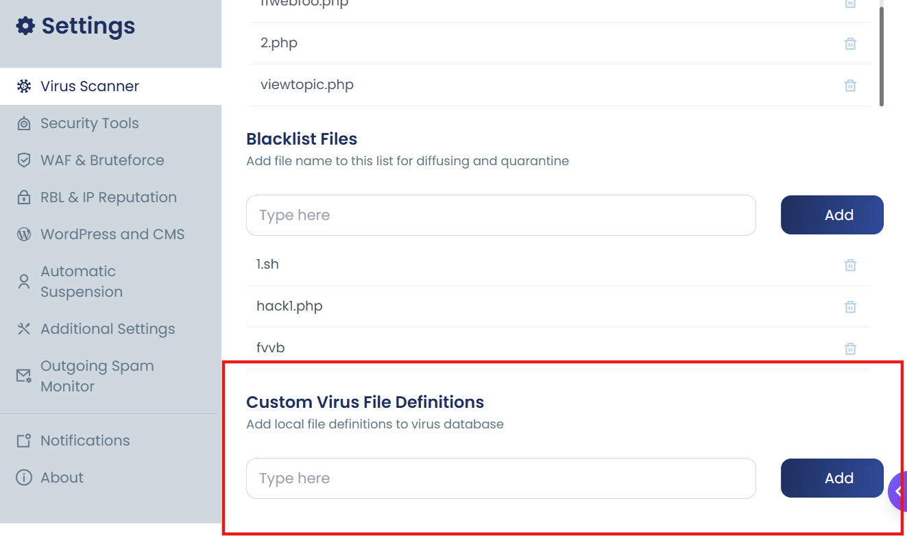

## Actions on detected files

Using below options you can change the actions perfomed by the scanner when an infected file is detected


:::note
Allowed options are **email**, **disable**, or **quarantine**.
:::

| Command | Description |
|--------|-------------|
| `cpgcli file-action --virus` | Set virus file action |
| `cpgcli file-action --suspicious` | Set suspicious file action |
| `cpgcli file-action --binary` | Set binary file action |

> **Note:** The default action is **Email Only**. The scanner will not take any further action unless explicitly changed.

## Configuration via UI



1. Navigate to **Settings → Virus Scanner**
2. Under **What to do with**, select the action for each file type:
   - **Virus Files**
   - **Suspicious Files**
   - **Binary Files**
3. Choose one of the following options:

| Option | Behaviour |
|---|---|
| **Email Only** | Sends an alert. Use this to handle files manually. |
| **Quarantine** *(Recommended)* | Moves the file to a secure quarantine directory. |
| **Disable File** | Sets file permissions to `000`, rendering it inaccessible. |

---

# Scanner Exclusions and Whitelisting

To reduce server overhead and prevent false positives, cPGuard provides granular control over which files, users, and database signatures are bypassed by the scanner. These settings can be managed via the **App Portal > Settings > Scanner**.

:::info
User-level whitelisting is primarily designed for the **Automatic (Real-time) Scanner**. Files owned by whitelisted users may still be flagged during manual full-server scans if not specifically excluded by path.
:::

---

## Whitelist Users

Whitelisting a user instructs the real-time scanner to skip all files owned by that specific system user. This is useful for accounts running specialized development tools or administrative scripts that frequently trigger heuristic alerts.

### How to Whitelist a User
1. Navigate to **Settings > Scanner**.
2. Locate the **Whitelist Users** section.
3. Select the desired user from the dropdown menu.
4. Click **Add**.

---

## Whitelist Files

You can exclude specific files or directory paths from being flagged by the virus scanner. This is common for excluding legitimate socket files, large log files, or specific application assets that trigger false positives.

### Configuration
- **File Name/Path**: You can enter an absolute path (e.g., `/home/username/public_html/safe_script.php`) or a specific filename pattern.
- **Examples from the interface**:
    - `mysql.sock` (Excludes specific socket files)
    - `plugins/getastra/astra/libraries/plugins/astra-gk/var/db` (Excludes specific plugin directories)

---

## Whitelist DB Scan Signatures

The Database Scanner identifies malicious injections based on specific signature IDs. If a legitimate database entry is being flagged, you can exclude that specific signature.

* **Signature ID**: The unique identifier of the signature provided in the scan report.
* **Reason**: A mandatory field to document why the signature is being excluded for future audit purposes.

---


## Whitelist Logic and Best Practices

* **Use Path-Specific Whitelisting**: Whenever possible, whitelist the exact file path rather than an entire user to maintain a high security posture.
* **Document Your Exclusions**: Always provide a reason when whitelisting database signatures to help other administrators understand the exception.
* **Review Periodically**: Regularly audit your whitelist to ensure that temporary exclusions are removed once they are no longer needed.
* **System Files**: Avoid whitelisting broad system paths; cPGuard is already optimized to ignore most non-web system files by default.

## Blacklist Files

The Blacklist is the inverse of whitelisting. It allows you to specify filenames that should always be treated as threats, regardless of their content. If the scanner encounters a blacklisted file, it will be immediately diffused or quarantined.

This is highly effective for blocking common attack scripts or persistent malware filenames like:
- `1.sh`
- `libworker.so`
- `cmd.php`

---

There are two methods to blacklist a file. Each method behaves differently once a match is detected, so choose the approach that best fits your use case.

| Method | Trigger | Action on Detection |
|---|---|---|
| **File Name** | Matches by filename | Always quarantines the file immediately |
| **Checksum (MD5)** | Matches by file content | Follows your configured "Action for virus files" preference |

---

## Method 1 : Blacklist by File Name

File name-based blacklisting quarantines any file matching the specified name as soon as it is detected, regardless of its location on the server.

> **Note:** Enter the file name only — do not include the full file path.


**Via UI:**
1. Navigate to **Settings →Virus Scanner**
2. Locate the **Blacklisted Files** field
3. Enter the file name (e.g., `malware.php`, `shell.py`)
4. Add — the rule becomes active instantly



---

## Method 2 : Blacklist by Checksum (MD5)

Checksum-based blacklisting adds the file's MD5 hash to the virus database, allowing the scanner to detect the file regardless of its name or location. When detected, the configured **Action for virus files** preference is applied rather than an automatic quarantine.

> **Note:** Checksum-based entries are not applied instantly for manual scans. However, the automatic scanner loads the changes instantly.



**Via UI:**
1. Navigate to **cPGuard → Settings → Virus Scanner**
2. Locate the **Custom Virus File Definitions** field
3. Enter the definition.
4. Click **Add**

---

## Blacklisting Files via CLI (During a Scan)

You can also apply a blacklist directly when running a manual scan by passing a reference file containing blacklisted file names or paths.

```bash
cpgcli scan --blacklist path
```

The `--blacklist` flag accepts a path to a file containing the blacklisted file names or paths to be applied during that scan session.

**Example: Scan a directory with a custom blacklist file:**
```bash
cpgcli scan --blacklist  /etc/cpguard/my-blacklist.txt
```
