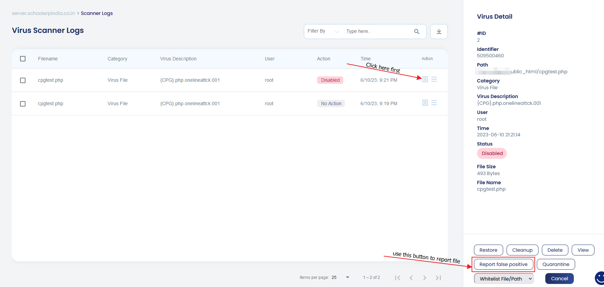

# Reporting Files

Security is a collaborative process. While cPGuard is powered by an extensive signature database and AI heuristics, new threats emerge daily and false positives can occasionally occur. This document explains how to report files for review and how to add your own custom security definitions.

---

## Reporting Files for Analysis

If the scanner misidentifies a file or misses a known threat, you can submit the file directly to the cPGuard research team. This feedback helps improve the detection engine for all users.

### 1. Reporting a False Positive
If a legitimate file is flagged as a virus, you should report it to prevent it from being quarantined in the future.

* **From the App Portal**: 
    1. Go to **Scanner Logs**.
    2. Locate the file in question and click the **File Details** icon.
    3. Click the **Report False Positive** button in the pop-up menu.




* **Via CLI**: Use the following command with the exact file path (works for files currently in quarantine or in their original location):
    ```bash
    cpgcli report --false-positive <file_path>
    ```

### 2. Reporting a Missed Virus File

Like any other scanner engine, the cPGuard scanner also works based on how it is trained with the virus samples. If cPGuard scanner is not reporting a virus file after the files scan, you may report the particular virus file to us so that we can check, analyze and update the scanner engine to detect similar files in the future.

You can use the following command to report a virus file for our review


    ```bash
    cpgcli report --virus <file_path>
    ```

---

## Custom Virus File Definitions

If you have specific local threats or unique strings that you want to block across your server, you can add them to your local database via the **Custom Virus File Definitions** section in the App Portal.

- **Adding Definitions**: This allows you to define your own signatures that the scanner will treat as a confirmed threat.
- **Manual Control**: This is useful for enterprise environments that have internal security policies or specific proprietary files they wish to flag as "not allowed" on web roots.
