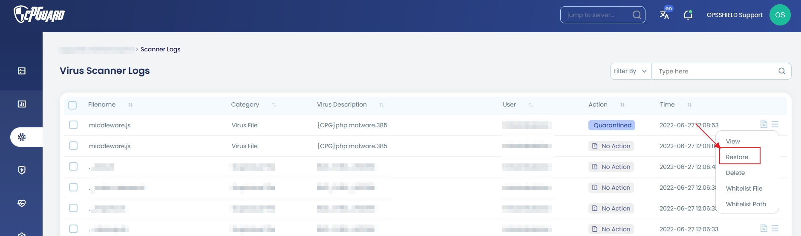
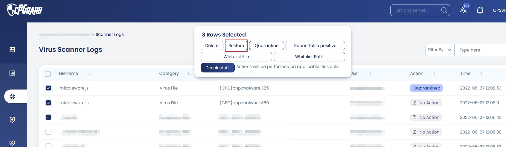

# How to Restore a Quarantined File in cPGuard

When cPGuard's scanner detects a threat and the configured file action is set to **quarantine**, the flagged file is moved to a secure quarantine directory rather than deleted outright. This preserves the file while removing it from its active web-accessible location — giving you the opportunity to review, restore, or permanently remove it.

This guide explains how to safely restore quarantined files back to their original location, and what to do if a legitimate file has been incorrectly flagged.

{/* comment */}

---

## Important: Never Copy Files Manually from Quarantine

Even though cPGuard uses a consistent naming convention that makes quarantined files easy to identify, you should **never directly copy or move a file from the quarantine directory back to its original location** using the command line or a file manager.

Always use the built-in restore functionality in the cPGuard App Portal or CLI. The restore process handles more than just moving the file. It correctly updates scanner log records, restores original file permissions and ownership, and ensures the file is handled cleanly within cPGuard's tracking system.

:::warning
Manually copying files from the quarantine directory bypasses cPGuard's restore tracking and may result in incorrect permissions, broken scanner log records, or the file being immediately re-detected and re-quarantined. Always use the App Portal restore function or the CLI restore command.
:::

---

## Restoring a Single File

To restore one specific quarantined file:

1. Log in to the **cPGuard App Portal** and open your server.
2. Navigate to **Virus Scanner → Scanner Logs**.
3. Locate the file you want to restore in the log list.
4. Click the **Actions** icon on the right side of the file's row.
5. Select **Restore** from the pop-up menu.



The file will be moved from the quarantine directory back to its original location with the correct permissions and ownership restored.

---

## Restoring Multiple Files at Once

If you need to restore several files in a single operation, for example, after identifying a batch of false positives. cPGuard supports bulk restore directly from the Scanner Logs:

1. Log in to the **cPGuard App Portal** and open your server.
2. Navigate to **Virus Scanner → Scanner Logs**.
3. **Select** all the files you wish to restore using the checkboxes on each row.
4. From the pop-up action menu that appears, select **Restore**.



All selected files will be restored to their original locations in one operation.

:::tip
If you need to restore files using the CLI, use the `log-action` command with the restore flag and appropriate filters:

```bash
# Restore a specific file by log ID
cpgcli log-action --restore --log-id 54845

# Restore all files from a specific scan
cpgcli log-action --restore --scan-id 12

# Restore all files flagged in the last 24 hours
cpgcli log-action --restore --from '-24 hours' --to 'now'
```
:::

---

## What to Do If a File Is a False Positive

cPGuard's scanner engine is built to minimise false positives, but no scanner is perfect. If a legitimate file has been incorrectly flagged and quarantined, the right course of action is to restore it **and** report it as a false positive so the cPGuard team can refine the detection rules.

:::note
Mass restores are not expected to be a common occurrence. If you find yourself restoring large numbers of files, it is worth investigating whether the files are genuinely clean or whether the detections are accurate.
:::

### How to Report a False Positive

After restoring the file, report it to the cPGuard team. So the rule can be reviewed and refined. Reporting false positives directly benefits the entire cPGuard user base by improving the accuracy of the shared detection rules.

Refer the following link for the steps to report a False Positive

   → [Report False Positive](./report-files#1-reporting-a-false-positive)


---

