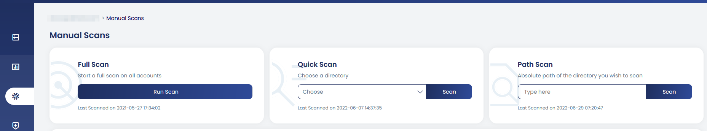

# How to Start a Manual Files Scan in cPGuard

While cPGuard's automatic scanner continuously monitors your server for newly modified or uploaded threats, there are times when you need to trigger a **manual scan on demand** after restoring a backup, onboarding a new website, responding to a suspected compromise, or simply running a routine deep check. cPGuard provides full flexibility to initiate manual scans against any target, from both the App Portal UI and the command line.

{/* comment */}

---

## Scan Targets Available

When starting a manual scan, you can choose from three types of targets depending on how broad or focused you need the scan to be:

| Scan Target | What It Scans |
|---|---|
| **All public files** | All files within the document root of every website on the server. Whitelisted users are excluded. |
| **Specific document root** | A single website's document root, selected from a dropdown list of hosted sites |
| **Specific directory** | Any custom path you enter manually |

:::note
cPGuard is a **Web Security Suite**. Its scanner engine is specifically designed to scan web-related files. It is strongly recommended to scan only web-specific directories (document roots, upload directories, etc.) to avoid false positive reports on system or application files that are not web-related.
:::

---

## Method 1 : Start a Scan from the App Portal UI

The App Portal provides a visual interface for initiating and monitoring manual scans.

**Steps:**

1. Log in to the **cPGuard App Portal** and open your server.
2. Navigate to **Virus Scanner → Manual Scans**.
3. Choose your scan target:
   - **Full Scan** : Start a full scan on all accounts on the Server
   - **Quick Scan** : Scan directory that you selected from the dropdown list of hosted sites
   - **Path Scan** : Absolute path of the directory you wish to scan





4. Click **Scan** button to begin.

Once the scan is running, you can monitor its **real-time progress** directly from the Manual Scans page. After completion, the results are available for review in the same interface, where you can take action on any detected files.

:::tip
The App Portal UI is the best option when you want to monitor scan progress in real time or when scanning a specific user's document root from the dropdown. it's faster and more visual than using the CLI for one-off scans.
:::

---

## Method 2 : Start a Scan via CLI

For administrators who prefer the terminal, or need to automate scan triggers as part of a maintenance or incident response script, all manual scan options are available through `cpgcli`.

### Scan All Public Files

```bash
cpgcli scan --all
```

Scans all files within the document roots of all websites on the server. Whitelisted users are excluded from this scan.

### Scan Files Modified in the Last 24 Hours

```bash
cpgcli scan --daily
```

Scans only files modified within the last 24 hours across all watchlist directories — faster than a full scan and ideal for catching recent infections.

### Scan Files Modified in the Last 7 Days

```bash
cpgcli scan --weekly
```

Scans files modified within the last 7 days — a broader incremental scan that balances coverage and speed.

### Scan a Specific Directory

```bash
cpgcli scan --path /path/to/directory
```

Scans a specific directory path you provide. Replace `/path/to/directory` with the full absolute path of the target directory.

**Example — scan a specific user's public_html:**

```bash
cpgcli scan --path /home/username/public_html
```

---


## Viewing Scan Results and Taking Action

After a manual scan completes, the results are available in the **App Portal → Virus Scanner → Manual Scans** section. From there you can:

- **Review** detected files with their threat classifications
- **Quarantine** confirmed threats
- **Restore** false positives to their original location
- **Whitelist** files or users you want excluded from future scans
- **View results** of the scan with ID via CLI: `cpgcli scan --result ID`

---

