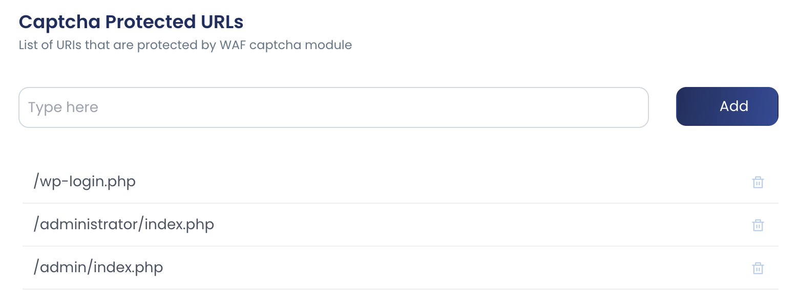
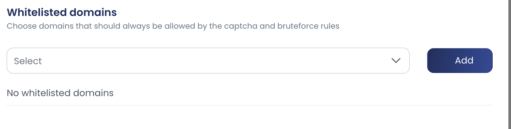

cPGuard CAPTCHA protection helps protect CMS login pages and other critical URLs from bots, scripts, and distributed brute-force attempts. It automatically covers common targets such as WordPress and Joomla login pages and can also protect custom URLs that you define.

Unlike a basic on-page challenge, cPGuard uses offsite verification and risk analysis to distinguish legitimate visitors from automated traffic before requests reach your login endpoint. This reduces brute-force load on the application while still allowing valid users to continue.

## Why Use CAPTCHA Protection

CAPTCHA protection is designed for login pages and other high-risk URLs that are repeatedly targeted by bots.

It helps by:

- Blocking automated login attempts against CMS and web application entry points
- Reducing server load by offloading verification logic away from the protected application
- Protecting both predefined CMS URLs and custom sensitive endpoints
- Allowing legitimate visitors through after successful verification

This is especially useful for slow, distributed brute-force attacks that rotate IP addresses and can be difficult to stop cleanly with rate limiting alone.

## How cPGuard CAPTCHA Works

When CAPTCHA protection is enabled, cPGuard intercepts requests to protected login or admin URLs before they reach the application.

1. Requests to protected CMS or custom URLs are intercepted.
2. Verification is handled through cPGuard CAPTCHA infrastructure.
3. Valid human visitors are redirected back to the requested page.
4. Repeated failed attempts can lead to the source IP being added to the real-time blacklist.

This flow helps reduce direct login abuse against the origin server.

## Protected URLs

cPGuard automatically protects common CMS login pages such as WordPress and Joomla entry points. You can also add your own custom URLs when a web application exposes other sensitive login or admin paths.

Typical examples include:

- `/wp-login.php`
- `/administrator/index.php`
- `/admin/index.php`
- Custom application login or admin URLs

Use custom protected URLs when a site has a non-standard login endpoint that should receive the same bot filtering as the default CMS paths.

Add a Protected URL

1. Log in to **App Portal**.
2. Select the server.
3. Go to **Settings** >> **WAF & Bruteforce**.
4. Find **Captcha Protected URLs**.
5. Enter the URI you want to protect.
6. Click **Add**.

Add only the path portion of the URL. In most cases this means values such as `/custom-login` or `/admin/index.php` instead of a full domain name.

## Whitelisted Domains

Use **Whitelisted Domains** only when a domain must bypass CAPTCHA checks completely. This is useful when a trusted application or workflow cannot complete verification properly, or when the domain is protected by another control that already handles bot access.

Do not whitelist domains as a general workaround for bot traffic. Whitelisting reduces cPGuard's ability to challenge suspicious requests for that domain.

### When to Whitelist a Domain

Whitelist a domain only when CAPTCHA protection interferes with legitimate traffic, such as:

- A trusted application endpoint that cannot complete CAPTCHA verification
- A domain already protected by another bot mitigation or access control layer
- A temporary compatibility issue during testing or migration

### Add a Whitelisted Domain

1. Log in to **App Portal**.
2. Select the server.
3. Go to **Settings** >> **WAF & Bruteforce**.
4. Find **Whitelisted Domains**.
5. Select the domain.
6. Click **Add**.

After adding a domain to the whitelist, test the affected login page or workflow again. If only one URL is problematic, prefer protecting only the required URLs instead of bypassing CAPTCHA for the entire domain.

## CAPTCHA Versions

cPGuard provides two CAPTCHA modes:

- **CAPTCHA V1**: the default and recommended option for most servers
- **CAPTCHA V2**: an advanced option for environments affected by DNS caching issues

Use V1 unless you are seeing repeated CAPTCHA prompts after successful verification.

## When to Use CAPTCHA V2

On some servers, DNS responses used during verification may be cached longer than expected. This can cause a user to complete verification successfully but still get challenged again.

If that happens, enable **CAPTCHA protection V2** from:

**App Portal** >> **Settings** >> **WAF & Bruteforce** >> **Captcha protection V2**

CAPTCHA V2 is more resource-intensive than V1, so it should be used only when you need to work around that verification loop behavior.

For a detailed explanation of this issue, see [Fix CAPTCHA Loop After Verification](../troubleshooting/waf/captcha-loop.md).

## Best Practices

- Keep CAPTCHA enabled for default CMS login pages
- Add custom protected URLs for non-standard login endpoints
- Whitelist entire domains only when there is a confirmed compatibility need
- Switch to CAPTCHA V2 only if you encounter the verification loop issue
