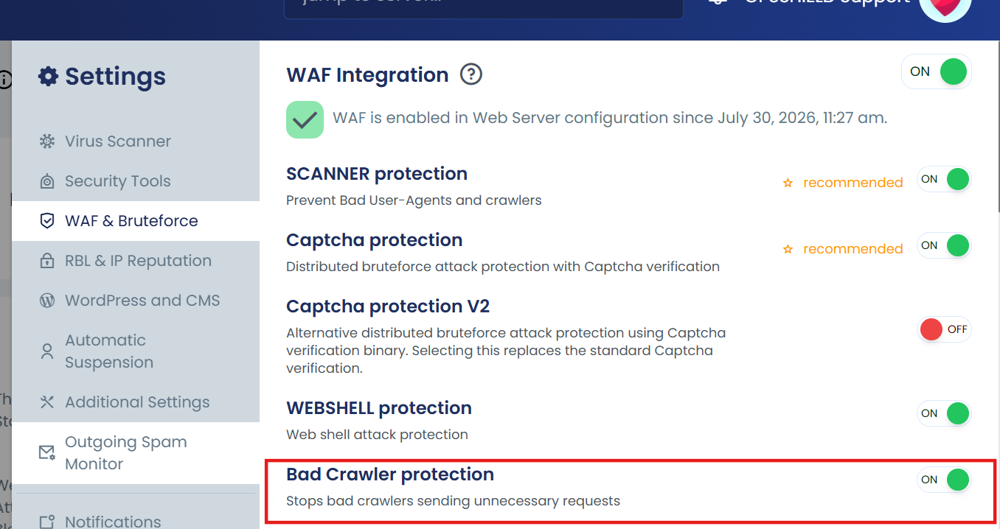

The **Bad Crawler Protection** feature in cPGuard is an additional **Web Application Firewall (WAF) protection layer(Layer 7)** designed to block known automated crawlers, AI agents, and data scraping bots from accessing websites.

Many AI services and search platforms use automated crawlers to collect website content. While some website owners may want their content to be indexed, others may prefer to prevent automated data collection.

When **Bad Crawler Protection** is enabled, cPGuard automatically identifies known crawler agents and blocks their requests before they reach the website.

When a visitor or automated bot sends a request to a website, cPGuard checks the incoming request and compares it against predefined WAF rules to identify known crawler agents.

If the request matches a blocked crawler identifier, the WAF blocks the request and prevents the crawler from accessing the website.

To enable or disable this protection, navigate to:

**cPGuard → Settings → WAF & Bruteforce → Bad Crawler Protection**

Use the toggle option to enable or disable the feature.



---

## How cPGuard Identifies AI Crawlers

Automated crawlers usually identify themselves using a **User-Agent** value included in the HTTP request.

Example:

```text
User-Agent: ClaudeBot
```

cPGuard includes predefined **crawler detection rules** for known AI crawlers and data scraping tools.

When a request matches one of these detection rules, the corresponding WAF rule is triggered and the crawler request is blocked.

---

The following crawler detection rules are included in the Bad Crawler Protection ruleset:

| Rule ID | Blocked Crawler / Agent |
|---------|-------------------------|
| 1200002 | ClaudeBot |
| 1200004 | GPTBot |
| 1200007 | ChatGPT |
| 1200009 | OpenAI |
| 1200008 | Meta-ExternalAgent |
| 1200010 | Amazonbot |
| 1200003 | Bytespider |
| 1200005 | ImagesiftBot |
| 1200006 | CCBot |
| 1200011 | Timpibot |
| 1200012 | Scrapy |
| 1200000 | MJ12bot |
| 1200001 | BLEXBot |

---

## Allowing Specific AI Crawlers

If you want to allow a specific AI crawler while keeping **Bad Crawler Protection** enabled for other crawlers, you can whitelist the required rule ID.

Example:

To allow **ClaudeBot** while keeping **Bad Crawler Protection** enabled for other crawlers, add the corresponding WAF rule ID to the whitelist.

For instructions on adding WAF rule whitelists, refer to:

[Whitelisting WAF Rules](https://support.opsshield.com/cpguard/waf/whitelist-rules)

Whitelist the following rule ID to allow ClaudeBot:

```text
1200002 - ClaudeBot