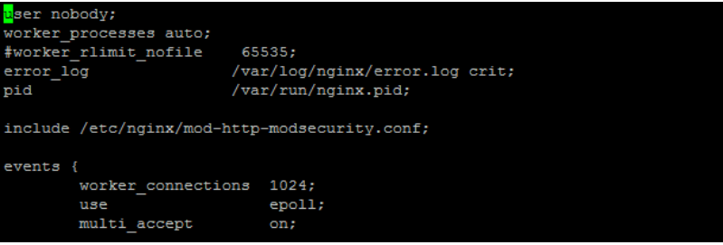

## What is ModSecurity?

ModSecurity is the most well-known open-source web application firewall (WAF) which was originally built for Apache Web server that provides comprehensive protection for your web applications (like WordPress, Joomla, OpenCart, etc) against a wide range of Layer 7 (HTTP) attacks. ModSecurity can work as the Web Server module and can filter out attacks like SQL injection, cross-site scripting, local file inclusion, etc

---

## cPGuard WAF

cPGuard WAF is a set of ModSecurity rules set that can block most of the generic web attacks against your web applications. It is powered by [Malware.Expert Commercial ModSecurity rules](https://malware.expert/modsecurity-rules/) for web hosting servers. It is a proprietary set of rules written in-house and provides protection against targeted and automated attacks and has explicit rules to protect CMS like WordPress, Joomla, etc.

---

## Install ModSecurity with Nginx on RHEL based distros

You need to install ModSecurity 3.0 ( libmodsecurity ) to enable ModSecurity module support with your Nginx Web Server. The ModSecurity 3 project is still under rapid development and lacks some features that is available in 2.9.x versions. But ModSecurity 3 is improving and come up with more features in all releases

---

### Step 1. Install Nginx

If you do not have Nginx Web Server installed on your server already, install Nginx using the following command. If you have Nginx installed already, you can ignore this step.

```bash
yum install nginx
```

---

### Step 2. Download and Compile ModSecurity

Install build dependencies using the following commands

```bash
yum groupinstall -y "Development Tools"
yum install -y httpd-devel pcre pcre-devel libxml2 libxml2-devel curl curl-devel openssl openssl-devel
```

Now you need to download ModSecurity

```bash
cd /usr/local/src
git clone --depth 100 -b v3/master --single-branch https://github.com/SpiderLabs/ModSecurity
cd ModSecurity
git submodule init
git submodule update
```

Now compile ModSecurity and install it on your server

```bash
# Generate configure file
sh build.sh
# Pre compilation step. Checks for dependencies
./configure
# Compiles the source code
make
# Installs the Libmodsecurity to /usr/local/modsecurity/lib/libmodsecurity.so
make install
```

---

### Step 3. Download and Compile ModSecurity v3 Nginx Connector Source Code

Run `nginx -V` and notice your Nginx server version. Now you need to download the matching Nginx source code and Nginx Connector Source Code into your server. The use the source code to generate Libmodsecurity module for your Nginx server. Refer following commands and run one by one in order.

```bash
mkdir /usr/local/src/cpg
cd /usr/local/src/cpg
# Make sure to change version number match it with your local Nginx server version
wget http://nginx.org/download/nginx-1.21.4.tar.gz
# Extract the downloaded source code...make sure to use the correct Nginx version number that you have downloaded
tar -xvzf nginx-1.21.4.tar.gz
# Download the source code for ModSecurity-nginx connector
git clone https://github.com/SpiderLabs/ModSecurity-nginx
```

**Compile Nginx**

Next we need to compile Nginx with ModSecurity module. We will not compile/install Nginx itself but compile the Nginx module only. For this, make sure that your Nginx package is compiled with `--with-compat` flag. The `--with-compat` flag will make the module binary-compatible with your existing Nginx binary. You can use the following command to compile Nginx + ModSecurity compatible with your existing modules

```bash
# Compile the Nginx...make sure to use the correct Nginx version number that you have downloaded
cd nginx-1.21.4
./configure --with-compat --with-openssl=/usr/include/openssl/ --add-dynamic-module=/usr/local/src/cpg/ModSecurity-nginx
```

If your Nginx package is not compatible with `--with-compat` flag, you can check your existing compile flags and use it to build the package. Given below is an example command that you can use for CloudPanel.

```bash
cd nginx-1.21.4
./configure --with-cc-opt='-g -O2 -fdebug-prefix-map=/home/clp/packaging/nginx/tmp/nginx-1.21.4=. -fstack-protector-strong -Wformat -Werror=format-security -fPIC -Wdate-time -D_FORTIFY_SOURCE=2' --with-ld-opt='-Wl,-z,relro -Wl,-z,now -fPIC' --prefix=/usr/share/nginx --conf-path=/etc/nginx/nginx.conf --http-log-path=/var/log/nginx/access.log --error-log-path=/var/log/nginx/error.log --lock-path=/var/lock/nginx.lock --pid-path=/run/nginx.pid --modules-path=/usr/lib/nginx/modules --http-client-body-temp-path=/var/lib/nginx/body --http-fastcgi-temp-path=/var/lib/nginx/fastcgi --http-proxy-temp-path=/var/lib/nginx/proxy --http-scgi-temp-path=/var/lib/nginx/scgi --http-uwsgi-temp-path=/var/lib/nginx/uwsgi --with-debug --with-pcre-jit --with-http_ssl_module --with-http_stub_status_module --with-http_realip_module --with-http_auth_request_module --with-http_v2_module --with-http_dav_module --with-http_slice_module --with-threads --with-http_addition_module --with-http_geoip_module=dynamic --with-http_gunzip_module --with-http_gzip_static_module --with-http_image_filter_module=dynamic --with-http_sub_module --with-stream_ssl_module --with-stream_ssl_preread_module --with-mail=dynamic --with-mail_ssl_module --add-dynamic-module=/usr/local/src/cpg/ModSecurity-nginx
```

Now we need to build the modules and copy it to the Nginx module directory

```bash
# Generate the module
make modules
# Copy the module to the Nginx module directory
cp -p objs/ngx_http_modsecurity_module.so /usr/lib64/nginx/modules/
```

---

### Step 4. Load ModSecurity Module into Nginx

Open file `/etc/nginx/mod-http-modsecurity.conf` and add the following contents to it.

```
load_module modules/ngx_http_modsecurity_module.so;
```

Now open `/etc/nginx/nginx.conf` and add the following line before events tag

```
load_module modules/ngx_http_modsecurity_module.so;
```

---



### Step 5. Install Nginx Configuration

**1.** Open `/etc/nginx/conf.d/nginx_modsec.conf` and add the following line into it.

```
modsecurity on;
modsecurity_rules_file /etc/nginx/cpguard-modsecurity.conf;
```

**2.** Add the following contents to `/etc/nginx/cpguard-modsecurity.conf`

```
SecRuleEngine On
SecRequestBodyAccess On
SecDefaultAction "phase:2,deny,log,status:406"
SecRequestBodyLimitAction ProcessPartial
SecResponseBodyLimitAction ProcessPartial
SecRequestBodyLimit 13107200
SecRequestBodyNoFilesLimit 131072
SecPcreMatchLimit 250000
SecPcreMatchLimitRecursion 250000
SecCollectionTimeout 600
SecDebugLog /var/log/nginx/modsec_debug.log
SecDebugLogLevel 0
SecAuditEngine RelevantOnly
SecAuditLog /var/log/nginx/modsec_audit.log
SecUploadDir /tmp
SecTmpDir /tmp
SecDataDir /tmp
SecTmpSaveUploadedFiles on
# Include file for cPGuard WAF
Include /etc/nginx/cpguard_waf.conf
```

---

### Step 6. Configure cPGuard WAF Parameters

Once the above steps are completed successfully, you can use the following parameter values from the cPGuard [Standalone configuration reference](../../standalone/instalation)

```
waf_server = nginx
waf_server_conf = /etc/nginx/cpguard_waf.conf
waf_server_restart_cmd = /usr/sbin/service nginx restart
waf_audit_log = /var/log/nginx/modsec_audit.log
```

---

## That's it

You should have ModSecurity enabled fine and once the cPGuard WAF is enabled, your server is protected against Web Attacks.
