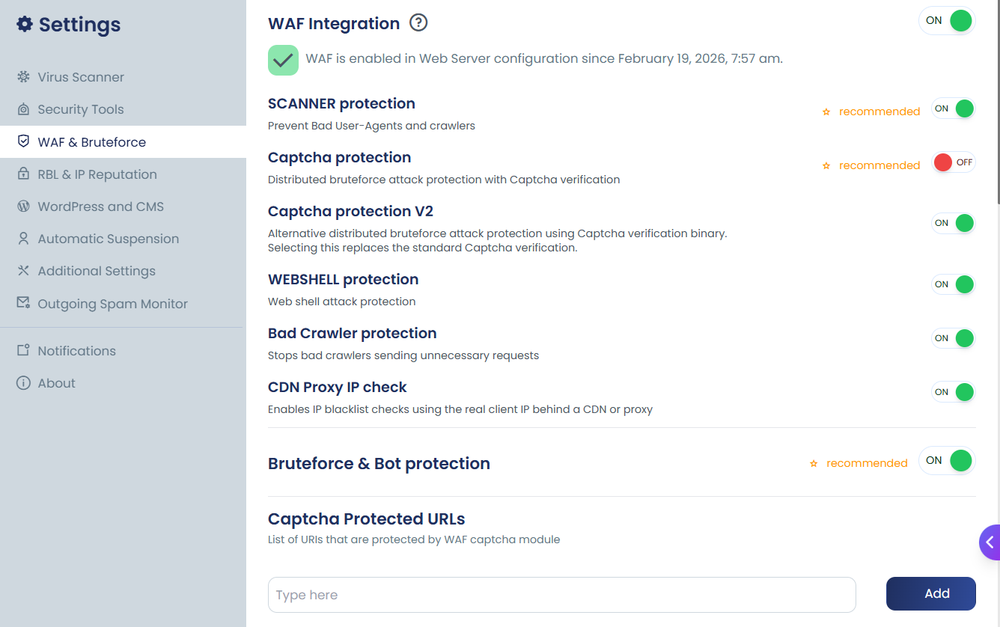

The cPGuard Web Application Firewall (WAF) provides powerful Layer 7 protection against web attacks using carefully crafted ModSecurity rules. The rules are based on Malware.Expert’s commercial ruleset combined with additional in-house rules to protect popular CMS platforms and hosting environments.

The Malware.Expert rule set is developed from over a decade of real-world threat intelligence gathered from penetration tests, live investigations, and traffic data across more than **100,000 domains**. This makes the rules battle-tested against the kind of attacks that hosting servers actually face in production environments.


---

## What is cPGuard WAF?

cPGuard WAF is a set of ModSecurity rules that analyze HTTP request and response bodies, headers, cookies, and parameters to identify web attack attempts.

Each incoming request is evaluated against rule conditions.  
When a malicious pattern is detected:

- The request is blocked
- A `403` or `406` response is returned
- A Rule ID is logged for review and troubleshooting

---

## Protection Coverage

### Generic Attack Categories

- **SQL Injection (SQLi)** — Prevents database manipulation attacks  
- **Cross-Site Scripting (XSS)** — Blocks script injection attempts  
- **Local File Include (LFI)** — Stops unauthorized file access  
- **Remote File Include (RFI)** — Prevents remote code execution  
- **File Upload Exploits** — Blocks malicious upload attempts  
- **Zero-Day Exploits** — Protection against newly discovered attack vectors  
- **Web Shell Execution** — Prevents backdoor script activity  

---

### Application-Specific Rules

Optimized protection for:

- WordPress (including brute-force login protection)
- Joomla (including brute-force login protection)
- Drupal

---

## Requirements

Before enabling WAF:

- ModSecurity version **2.9.4 or higher**
- Supported Web Server:
  - Apache
  - Nginx
  - LiteSpeed
  - OpenLiteSpeed
- Public IPv4 or IPv6 address
- `SecRuleEngine` must be enabled
- OWASP rules must be **disabled** (incompatible with cPGuard WAF)

:::tip
👉 **See [Setup Documentation](../setup/overview.md) for control panel-specific configuration.**
:::

---

## Enable / Disable WAF

WAF is turned **OFF by default during installation** to avoid conflicts with existing ModSecurity rule sets.

You may enable it anytime after verifying requirements.



---

### Enable WAF

```bash
cpgcli waf --enable
````

Enable with optional modules:

```bash
cpgcli waf --enable=scanner,webshell,captcha,crawler
```

---

### Disable WAF

```bash
cpgcli waf --disable
```

Disable specific modules:

```bash
cpgcli waf --disable=scanner,webshell,captcha,crawler
```

---

## Optional Rule Sets

You may enable additional rule modules for enhanced protection.

### RBL Protection

Advanced POST DDoS and brute-force protection.  
Blocks abusive IP addresses collected through the cPGuard distributed network.

---

### Captcha Protection  (Recommended)

Forces human verification before accessing CMS login pages.

- Protects WordPress / Joomla login
- Reduces brute-force load
- Significantly lowers server resource usage

---

### Webshell Protection

Blocks execution of common PHP shells such as:

- Phoenix WebShell  
- FilesMan  
- c99  
- b374k  
- WSO  
- Ani-Shell  

The shell interface may load, but command execution (copy, delete, move, etc.) is blocked.

---

### Scanner Protection (Recommended)

Blocks:

- Malicious user agents
- Aggressive crawlers
- Resource-intensive bots
- Abusive search engine scanners

Helps reduce unnecessary CPU and I/O load.

---

### Proxy IP Check
A Layer 7 extension that detects the real visitor IP behind proxies like CloudFlare (using headers like X-Forwarded-For) to ensure malicious users aren't bypassing the firewall.

You can find more details of proxy ip check here

---

## PHP Upload Blocking (WAF Module)

You can prevent PHP file uploads via:

* Web forms
* Web file managers
* Web shells

⚠ When enabled, PHP files cannot be edited through web-based file managers.

### Enable

```bash
cpgcli upload-scanner --block-php=enable
```

### Disable

```bash
cpgcli upload-scanner --block-php=disable
```

---

## Proxy IP Check (Layer 7 IP Detection)

System-level firewalls like IPDB operate at Layer 3 and only see the IP directly connecting to the server. When your server sits behind a CDN or proxy (Cloudflare, Fastly, load balancers, reverse proxies), all traffic appears to come from the proxy IP — not the real visitor.

Proxy IP Check operates at Layer 7 (application layer) and extracts the real visitor IP from HTTP headers. It then checks this IP against:

- IPDB distributed firewall blocklist
- Local server blocklists

If the real IP is blocked, access is denied — even when coming through a proxy or CDN. The proxy IP itself remains unaffected and continues to function normally.

### When to Use

Enable Proxy IP Check when:

- Server is behind Cloudflare or another CDN
- Using reverse proxy (Nginx, HAProxy, etc.)
- Load balancer sits in front of your server
- Experiencing attacks that bypass IPDB through proxies

### Supported Headers

The WAF inspects these HTTP headers to identify the real visitor IP:

| Header | Common Source |
|--------|---------------|
| `CF-Connecting-IP` | Cloudflare |
| `True-Client-IP` | Akamai, Cloudflare |
| `X-Real-IP` | Nginx reverse proxy |
| `X-Forwarded-For` | Standard proxy header |
| `Fastly-Client-IP` | Fastly CDN |
| `X-Client-IP` | Various proxies |
| `X-Cluster-Client-IP` | Load balancers |
| `Forwarded` | RFC 7239 standard |
| `REMOTE_ADDR` | Direct connection (fallback) |

### Enable

```bash
cpgcli waf --enable=proxycheck
```

### Disable

```bash
cpgcli waf --disable=proxycheck
```

---

## Whitelisting Rules

If a rule causes a false positive:

```bash
cpgcli waf --whitelist --add RULE_ID
cpgcli waf --whitelist --remove RULE_ID
```

Use the Rule ID from WAF logs to whitelist specific triggers instead of disabling modules globally.

---

## Applying Changes

WAF configuration updates may require:

* ModSecurity reload
* Web server restart

Changes may apply with slight delay as cPGuard groups updates to perform a single optimized restart.

