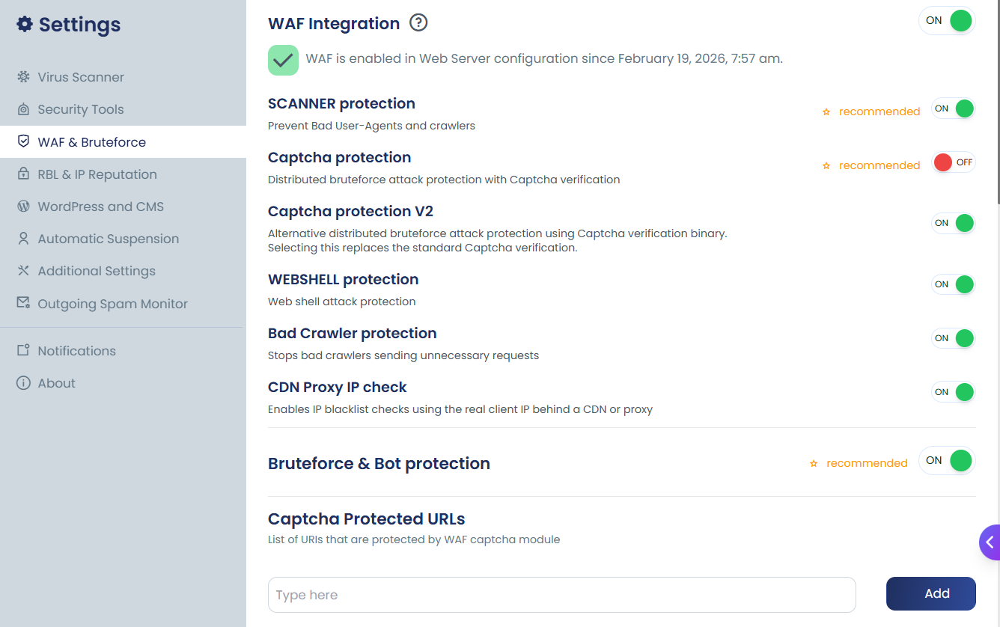

cPGuard WAF is a Layer 7 ModSecurity ruleset for blocking common web attacks with low operational overhead. It combines Malware.Expert commercial signatures with cPGuard in-house rules tuned for hosting workloads.

cPGuard WAF inspects HTTP requests and responses (headers, body, cookies, and parameters). When a request matches a malicious pattern:

- The request is blocked
- A `403` or `406` response is returned
- A Rule ID is logged for review and troubleshooting

## Protection Coverage

### Generic Attack Categories

- **SQL Injection (SQLi)** — Prevents database manipulation attacks  
- **Cross-Site Scripting (XSS)** — Blocks script injection attempts  
- **Local File Include (LFI)** — Stops unauthorized file access  
- **Remote File Include (RFI)** — Prevents remote code execution  
- **File Upload Exploits** — Blocks malicious upload attempts  
- **Zero-Day Exploits** — Protection against newly discovered attack vectors  
- **Web Shell Execution** — Prevents backdoor script activity  

### Application-Specific Rules

Optimized protection for:

- WordPress (including brute-force login protection)
- Joomla (including brute-force login protection)
- Drupal

## Requirements

Before enabling WAF:

- ModSecurity version **2.9.4 or higher**
- Supported Web Server:
  - Apache
  - Nginx
  - LiteSpeed
  - OpenLiteSpeed
- Public IPv4 or IPv6 address
- `SecRuleEngine` must be enabled
- OWASP rules must be **disabled** (incompatible with cPGuard WAF)

:::tip
See [Panel-Specific Steps](panel-specific-steps.md) for control panel setup.
:::

---

## Enable / Disable WAF

WAF is turned **OFF by default during installation** to avoid conflicts with existing ModSecurity rule sets.

You may enable it anytime after verifying requirements.



### Using Command-line

```bash
# Enable WAF
cpgcli waf --enable

# Disable WAF
cpgcli waf --disable
```

## Enable / Disable Optional WAF Modules

Beyond the core rule set, cPGuard WAF includes several optional modules that can be enabled or disabled independently. You can control them by passing a comma-separated list of module names:

```bash
# Enable specific optional modules
cpgcli waf --enable=scanner,webshell,capthca,crawler

# Disable specific optional modules
cpgcli waf --disable=scanner,webshell,capthca,crawler
```

### Available Optional Modules

| Module | What It Does |
|---|---|
| `scanner` | Blocks bad crawlers and malicious scanning tools |
| `webshell` | Prevents PHP web shell command execution |
| `capthca` | Enforces CAPTCHA verification on CMS login pages |
| `crawler` | Blocks abusive and fake search engine crawlers |

:::tip
You can mix and match modules freely. For example, to enable only CAPTCHA and scanner protection without touching the other modules:

```bash
cpgcli waf --enable=capthca,scanner
```
:::

---

## Why WAF Is Disabled by Default

When cPGuard is first installed, the WAF is **turned off by default**. This is an intentional design decision. Many server administrators already have their own WAF rule sets or ModSecurity configurations in place. Enabling cPGuard's WAF on top of existing rules without review could cause conflicts.

You can safely enable it at any time once you have reviewed your server's existing configuration.

:::note
Before enabling WAF, make sure your server meets all prerequisites. Refer to the [Panel-Specific Steps](panel-specific-steps.md) page before proceeding.
:::

---

## What is WAF Health Check

The WAF Health Check is a background check that verifies the health and availability of the cPGuard WAF integration. It helps ensure that the WAF is properly configured and functioning as expected.

#### Disable WAF Health Check

Run the following command as root:

```bash
cpgcli waf --health-check disable
```

After disabling the health check, cPGuard will no longer perform the WAF health verification until it is enabled again.

#### Enable WAF Health Check

To re-enable the WAF Health Check, run:

```bash
cpgcli waf --health-check enable
```

---

### RBL Protection

Advanced POST DDoS and brute-force protection.  
Blocks abusive IP addresses collected through the cPGuard distributed network.

### Captcha Protection  (Recommended)

Forces human verification before accessing CMS login pages.

- Protects WordPress / Joomla login
- Reduces brute-force load
- Significantly lowers server resource usage

### Webshell Protection

Blocks execution of common PHP shells such as:

- Phoenix WebShell  
- FilesMan  
- c99  
- b374k  
- WSO  
- Ani-Shell  

The shell interface may load, but command execution (copy, delete, move, etc.) is blocked.

### Scanner Protection (Recommended)

Blocks:

- Malicious user agents
- Aggressive crawlers
- Resource-intensive bots
- Abusive search engine scanners

Helps reduce unnecessary CPU and I/O load.

---

### Proxy IP Check
A Layer 7 extension that extracts the real visitor IP behind proxies/CDNs, so blocking decisions are made on the true client address instead of the proxy IP.

See [Proxy IP Check](proxy-ip-check.md) for supported headers, usage scenarios, and configuration notes.

---

:::note
WAF configuration changes are not instant. cPGuard applies updates with a short delay and can automatically reload/restart required web services. If a change does not apply after a short wait, perform a manual restart.
:::


