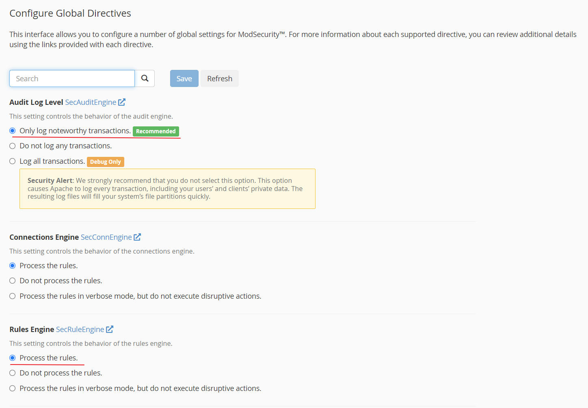
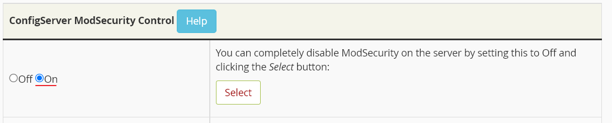
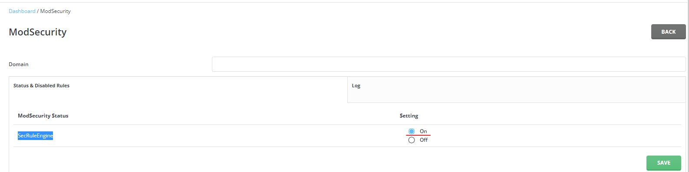
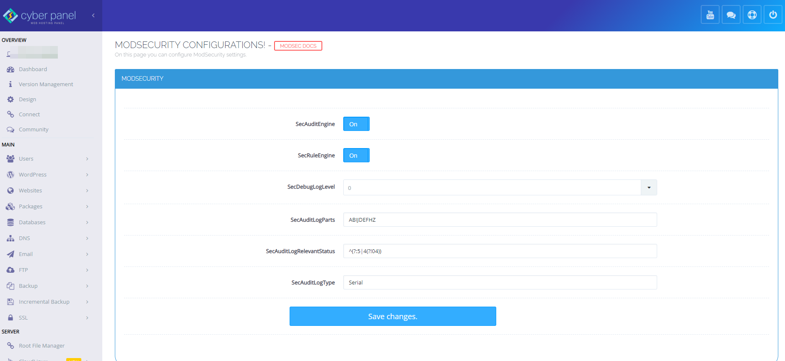
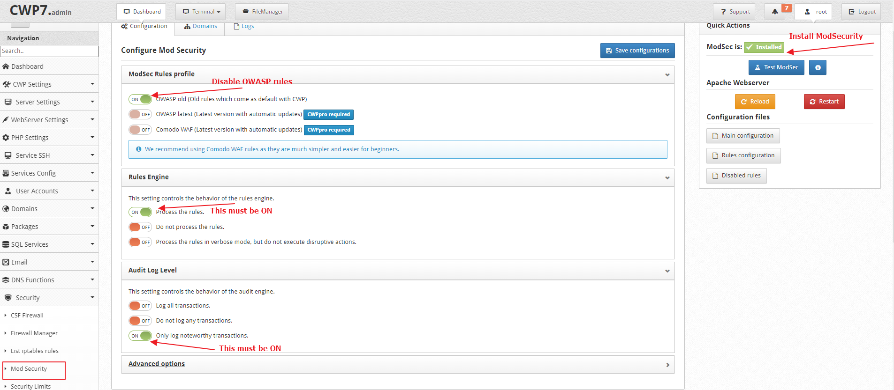
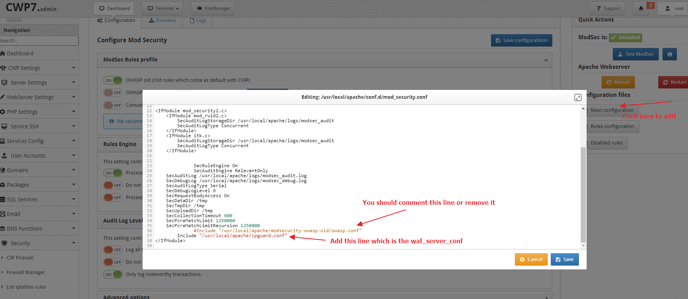
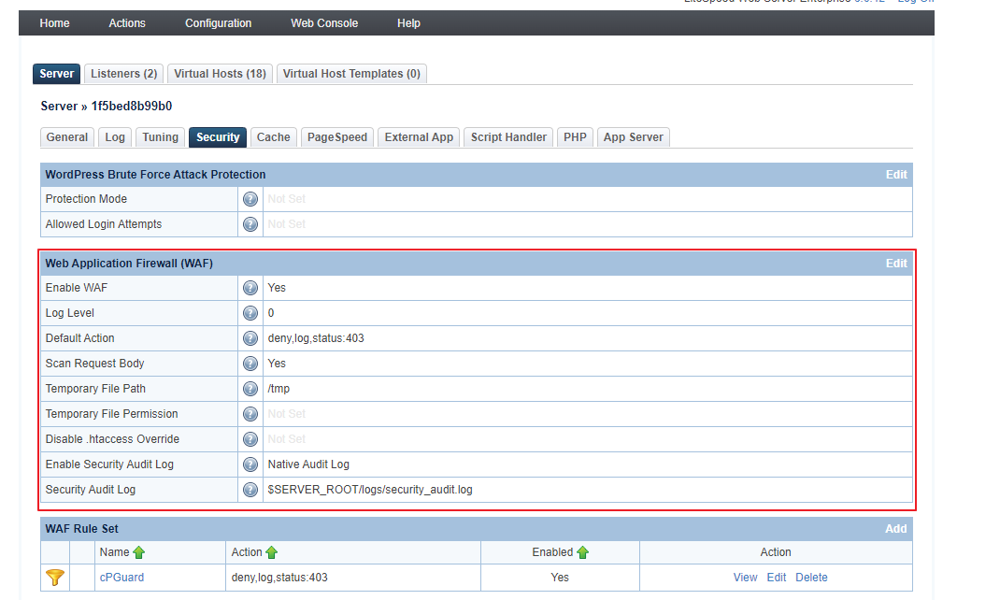
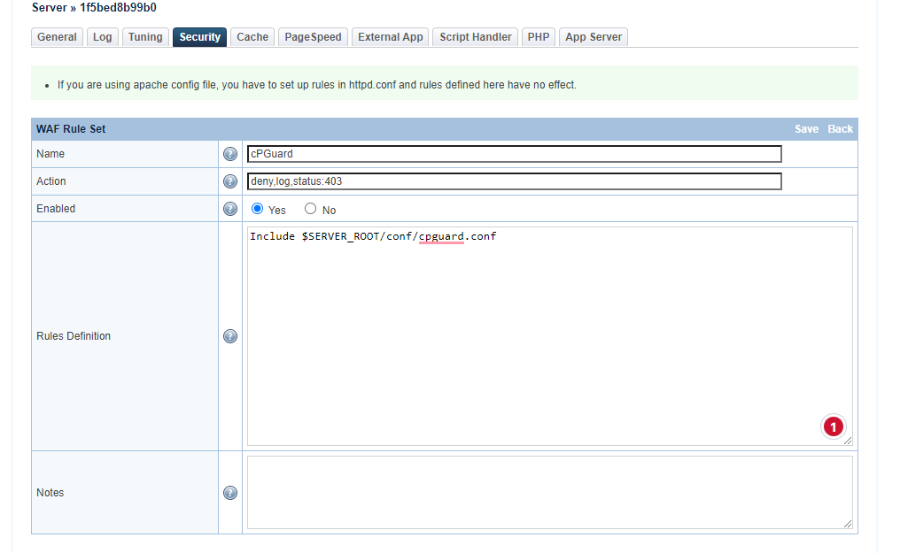

Use this page to configure your control panel before enabling cPGuard WAF.

## Go to your panel section

- [cPanel](#cpanel)
- [DirectAdmin](#directadmin)
- [Plesk](#plesk)
- [CyberPanel](#cyberpanel)
- [Control Web Panel (CWP)](#control-web-panel-cwp)
- [LiteSpeed with Enhance](#litespeed-with-enhance-control-panel)

## cPanel
---

Navigate to **Home >> Security Center >> ModSecurity Configuration >> Configure Global Directives**.

Set:

- **Audit Log Level (SecAuditEngine)**: Only log noteworthy transactions
- **Rules Engine (SecRuleEngine)**: Process the rules



:::warning
Do not enable additional ModSecurity vendor rules from WHM ModSecurity Vendors while using cPGuard WAF.
:::

Recommended baseline:

```text
SecRuleEngine On
SecAuditEngine On
SecAuditLogRelevantStatus "^(?:2|3|4|5)"
SecAuditLogParts ABDEFHIJZ
```

### ConfigServer ModSecurity Control (CMC)

If CMC is installed, keep ModSecurity enabled there as well.



## DirectAdmin
---

Run:

```bash
cd /usr/local/directadmin/custombuild
./build update
./build set modsecurity yes
./build set modsecurity_ruleset "no"
./build modsecurity
./build modsecurity_rules
./build rewrite_confs
```

Then verify in **DirectAdmin >> Server Manager >> ModSecurity** that **SecRuleEngine** is ON.



## Plesk
---

Use one of the following commands.

Apache:

```bash
plesk bin server_pref --update-web-app-firewall \
  -waf-rule-engine on \
  -waf-web-server apache \
  -waf-rule-set custom \
  -waf-archive-path /opt/cpguard/app/resources/cpg_modsec_enable.conf.zip
```

Nginx:

```bash
plesk bin server_pref --update-web-app-firewall \
  -waf-rule-engine on \
  -waf-web-server nginx \
  -waf-rule-set custom \
  -waf-archive-path /opt/cpguard/app/resources/cpg_modsec_enable.conf.zip
```

After this, enable cPGuard WAF from settings.

## CyberPanel
---

Navigate to **Server >> Security >> ModSecurity Conf** and set:

- Enable ModSecurity: ON
- SecRuleEngine: ON
- SecAuditEngine: ON
- SecAuditLogParts: ABIJDEFHZ



Then ensure **OWASP ModSecurity Core Rules** are disabled in Rule Packs.

Set a valid hostname resolving to your server IP so health checks can run correctly.

## Control Web Panel (CWP)
---

1. Enable ModSecurity in **CWP >> Security >> Mod Security**.



2. Update the main ModSecurity config in `/usr/local/apache/conf.d/mod_security.conf`.



3. Complete remaining steps in [CWP Standalone Configuration](../getting-started/panel-guides/cwp.md).

## LiteSpeed with Enhance Control Panel
---

In **Configuration >> Server >> Security**:

- Enable WAF: Yes
- Scan Request Body: Yes
- Enable Security Audit Log: Native Audit Log



Then add this ruleset in **WAF Rule Set**:

- Name: cPGuard
- Action: deny,log,status:403
- Enabled: Yes
- Rules Definition: Include `$SERVER_ROOT/conf/cpguard.conf`



Rules definition:

```text
Include $SERVER_ROOT/conf/cpguard.conf
```
