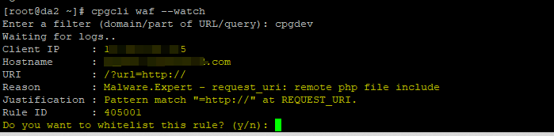
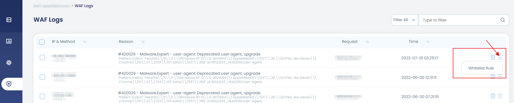
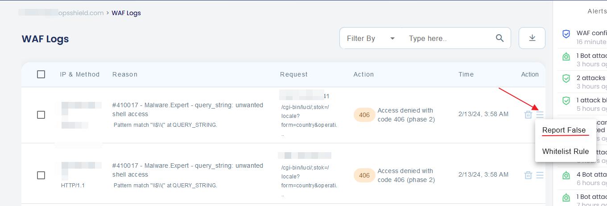

Whitelist specific WAF rules that cause false positives or block legitimate traffic for your applications. Each rule is identified by a unique Rule ID.

## When to Whitelist Rules

Whitelist a rule when:
- Legitimate requests are blocked (false positive)
- Your application requires specific patterns that trigger security rules
- Testing confirms the blocked traffic is safe for your environment
- The rule is too aggressive for your specific use case

:::warning[Security Impact]
Only whitelist rules after confirming the blocked traffic is legitimate. Whitelisting removes protection for that attack pattern.
:::

## Find the Rule ID

Before whitelisting, identify the Rule ID that triggered the block:

### Method 1: Using Watch Mode (Recommended)

```bash
cpgcli waf --watch
```

Enter a filter pattern (IP, domain, or URI), then recreate the incident. The Rule ID will be displayed.




### Method 2: From App Portal

1. Log in to App Portal → Select your server
2. Navigate to **Security** → **WAF Logs**
3. Find the blocked request
4. Note the **Rule ID** from the log entry




### Method 3: From Web Server Logs

Check ModSecurity audit logs:

```bash
grep "id:" /var/log/modsec_audit.log
```

Look for the `id:` field in blocked requests (e.g., `id: 4500006`).

## Add Rule to Whitelist

Once you have the Rule ID, add it to the whitelist.

### Using CLI

Add a single rule:

```bash
cpgcli waf --whitelist --add 4500006
```

Add multiple rules at once:

```bash
cpgcli waf --whitelist --add 4500006
cpgcli waf --whitelist --add 4500007
cpgcli waf --whitelist --add 4500008
```

### Using App Portal

1. Log in to App Portal → Select your server
2. Navigate to **Settings** → **WAF**
3. Scroll to **Whitelisted Rules** section
4. Enter the Rule ID
5. Click **Add to Whitelist**

## Remove Rule from Whitelist

If you need to re-enable protection, remove the rule from the whitelist.

### Using CLI

```bash
cpgcli waf --whitelist --remove 4500006
```

### Using App Portal

1. Log in to App Portal → Select your server
2. Navigate to **Settings** → **WAF**
3. Find the rule in **Whitelisted Rules** section
4. Click **Remove** next to the Rule ID

## Apply Changes

:::info[Configuration Delay]
WAF configuration updates apply after a time delay (usually 1-2 minutes) and are typically followed by a web server restart.
:::

**Verify the change:**

1. Wait 1-2 minutes after whitelisting
2. Recreate the previously blocked request
3. Confirm the request succeeds
4. Check WAF logs to verify the rule no longer triggers

## View Whitelisted Rules

### Using CLI

List all whitelisted rules:

```bash
cpgcli waf --whitelist --list
```

### Using App Portal

1. Log in to App Portal → Select your server
2. Navigate to **Settings** → **WAF**
3. View the **Whitelisted Rules** section

## Common Rules to Whitelist

Some rules frequently require whitelisting for specific applications:

| Rule ID | Description | Common Reason |
|---------|-------------|---------------|
| 4500006 | XSS Pattern Detection | Rich text editors, HTML form content |
| 4500010 | SQL Injection Pattern | Complex search queries with special chars |
| 4500015 | File Upload Validation | Custom upload validation logic |
| 4500020 | Command Injection | Admin tools with CLI features |

:::tip[Best Practice]
- Whitelist specific Rule IDs rather than disabling entire rule sets
- Document why each rule was whitelisted
- Review whitelisted rules periodically
- Remove whitelisted rules when no longer needed
:::

## Whitelist vs. Disable Rule Sets

**Whitelist individual rules** when:
- Single specific rule causes issues
- You want granular control
- Most rules in the set work correctly

**Disable entire rule sets** when:
- Multiple rules from one set cause issues
- The entire set is incompatible with your environment
- Testing shows the set is too aggressive

Disable optional rule sets:

```bash
cpgcli waf --disable=webshell,rbl
```

See [WAF Overview](overview.md) for rule set details.


## Report a false positive for a WAF Rule Trigger

If you believe that the WAF rule triggered a false positive and the WAF is blocking a legitimate request, you may report it as a false positive. You may do it directly from the WAF logs page. The option to directly report a rule from the action menu against each entry ( refer image below ).




## Troubleshooting

### Whitelist Not Working

**Symptoms:** Rule still blocking after whitelisting

**Solutions:**
1. Wait 1-2 minutes for configuration to apply
2. Verify correct Rule ID was whitelisted
3. Manually restart web server:
   ```bash
   # Apache
   systemctl restart httpd

   # Nginx
   systemctl restart nginx

   # LiteSpeed
   /usr/local/lsws/bin/lswsctrl restart
   ```
4. Check whitelist was saved: `cpgcli waf --whitelist --list`

### Wrong Rule Whitelisted

**Symptoms:** Original issue persists, different Rule ID in new logs

**Solutions:**
1. Use watch mode to confirm exact Rule ID
2. Remove incorrect rule from whitelist
3. Add correct Rule ID
4. Test again

### Too Many Rules Whitelisted

**Symptoms:** Large whitelist, reduced security

**Solutions:**
1. Review all whitelisted rules
2. Test if each is still necessary
3. Remove rules no longer needed
4. Consider if application behavior can be modified instead

## Security Considerations

- Whitelisting bypasses protection for specific attack patterns
- Only whitelist after confirming traffic is legitimate
- Document business justification for each whitelisted rule
- Review whitelist during security audits
- Monitor for abuse of whitelisted patterns
