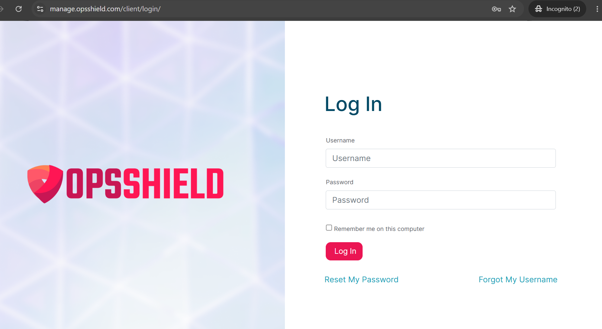
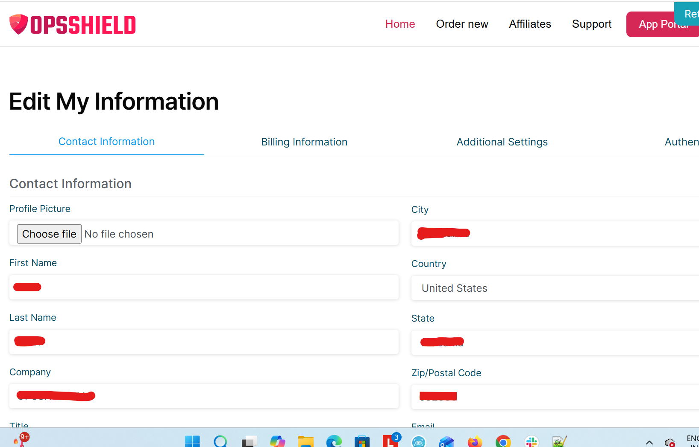

# Account Management

The OPSSHIELD Client Area at [https://manage.opsshield.com](https://manage.opsshield.com/client/login/) allows you to manage your account details, security settings, login access, and communication preferences.

This guide covers the most common account-related actions and troubleshooting steps.

> [!NOTE]
> The billing and client portal is hosted separately from the [App Portal](https://app.opsshield.com/) to keep account, billing, and financial information isolated from server management services.

---

## Accessing the Client Area

1. Open [https://manage.opsshield.com](https://manage.opsshield.com/client/login/)
2. Click **Login**
3. Enter your registered email address and password
4. Complete two-factor authentication if enabled

---

## Creating an Account

An OPSSHIELD client account is usually created when:

- Purchasing a license or trial
- Receiving an invitation to manage servers
- Being invited by another account owner

### During Registration

You may be asked to provide:

- Full name
- Email address
- Password
- Company name (optional)
- Billing address

> [!TIP]
> Use a permanent business email address whenever possible. License notices, invoices, and security notifications are sent there.

---

## Resetting Your Password

If you have forgotten your OPSSHIELD client portal password, you can reset it in just a few steps directly from the login page. This guide walks you through the full process.

---

## Before You Begin — Know Your Username

Your OPSSHIELD username is the **email address you used when creating your account** at the time of purchase. If you are unsure which email address that was, check your inbox for any order confirmation or welcome emails from OPSSHIELD.

:::tip
Your username is always your registered email address. Not a custom username you may have chosen elsewhere. Use the email address associated with your OPSSHIELD purchase.
:::

---

## Steps to Reset Your Password

### Step 1 : Go to the OPSSHIELD Client Portal Login Page

Open the following URL in your browser:

[https://manage.opsshield.com/client/login/](https://manage.opsshield.com/client/login/)

---

### Step 2 : Click "Reset My Password"

On the login page, click the **"Reset My Password"** link. This takes you to the password reset form.

---

### Step 3 : Enter Your Username and Submit

On the password reset form:

1. Enter your **registered email address** in the username field.
2. Click the **"Reset Password"** button.

---

### Step 4 : Check Your Email for the Reset Link

A password reset email will be sent to your registered email address. Open the email and click the reset link inside to set a new password.

:::note
If you don't see the reset email in your inbox within a few minutes, check your **spam or junk folder**. Automated emails from account management systems are sometimes filtered incorrectly.
:::

---
### Password Recommendations

Use a password that includes:

- Uppercase and lowercase letters
- Numbers
- Symbols
- Minimum 12 characters

Avoid:

- Reusing passwords from other services
- Using server hostnames or company names
- Simple dictionary words

---

## Enabling Two-Factor Authentication (2FA)

To enable 2FA on your OPSShield account:

1. Go to [https://manage.opsshield.com/client/main/edit/](https://manage.opsshield.com/client/main/edit/)
2. Select the **Authentication** tab
3. Enable the **"Enable Two-Factor Authentication"** option
4. Scan the QR code using an authenticator app on your mobile device

> **Note:**
> When enabling 2FA, both your **OTP token** (from the authenticator app) and your **account password** are required.
>
> You will need to enter your account password in two fields:
>
> 1. **Current Password**
> 2. **Confirm Password**
>
> Make sure to enter the correct password in both fields along with the right OTP token from your device for 2FA to be enabled successfully.

---

### Recommended Authenticator Apps

- Google Authenticator
- Microsoft Authenticator
- Authy
- 1Password

---

## Changing or edit My information

1. Go to [https://manage.opsshield.com/client/main/edit/](https://manage.opsshield.com/client/main/edit/)
2. Select the **contact information** tab

## Frequently Asked Questions

### I forgot both my password and 2FA device

Open a support ticket from the client area and provide sufficient account verification details.

---

### Can multiple people use the same account?

This is not recommended. Instead, invite additional users and assign proper permissions.

---

### Why am I not receiving emails?

Check spam filtering, DNS issues, or email forwarding rules. Also ensure your registered email address is correct.

---

### Can I change my registered email later?

Yes. You can update it from the profile settings page.

---

## Related Guides

* [Licenses & Plans](./license/overview)
* [Billing & Payments](./billing-and-payments)
