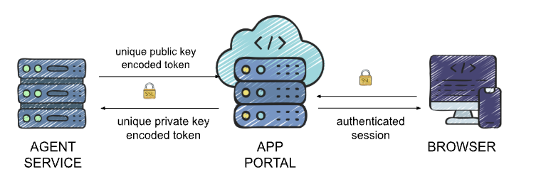

# Agent & Security Architecture

Understanding the cPGuard ecosystem requires looking at three distinct layers working in harmony. Instead of a direct, exposed connection between your browser and your server, cPGuard uses a **proxied relay model** to ensures that your server remains invisible to the public web while staying manageable from our portal.

## 1. The Three Pillars of the Stack

The architecture is divided into three functional pieces:

* **The UI:** The front-end dashboard you interact with. It never talks to your server directly; it only communicates with our secure backend.
* **The App Portal :** The "brain" in the middle. It handles authentication, validates your session, and acts as a secure messenger between you and your server.
* **The Local Agent:** A lightweight service running on your client server. It stays idle until it receives a verified, encrypted command from the App Portal.

---

## 2. The Journey of a Request

To keep your server's management port (9098) hidden from the general internet, every action follows a specific, one-way street:

1. **User Action:** Example, You click "Start All" in the **Angular UI**.
2. **Verification:** The UI sends this request to the **Laravel Backend**. The portal checks if you are logged in and if you have the right permissions for that specific server.
3. **The Encrypted Relay:** Once verified, the App Portal "repacks" your request into an encrypted API call.
4. **Agent Execution:** This request is sent over HTTPS to **Port 9098** on your server. The **Local Agent** decrypts the command, performs the task (like starting a scan), and sends the result back up the chain.

> **Note on cPGuard X:** In certain rare cases like for accesing phpMyAdmin, uploading/downloading files via filemanager etc, cPGuard X may establish a more direct path, but the standard architecture always prioritizes the shielded relay model.

---

## 3. Inside the Local Agent

The Agent is the "boots on the ground" on your server. It is designed to be invisible and unexploitable.

* **Technology:** Built on a custom, hardened Nginx+PHP stack optimized for zero overhead.
* **Isolation:** It runs as a **non-root user** (`cpguard`). Even in the impossible event of a breach, the agent directly has no permission to make system-wide changes—it can only perform pre defined actions.
* **Firewall Safety:** Your server only needs to accept traffic on Port 9098 from the **OPSSHIELD Cloud IP range**. This effectively "whitelists" our portal and blocks everyone else.

---

## 4. Authentication & The "Key" System

We use **Asymmetric RSA Encryption** to ensure that your agent *only* listens to our portal. Every license is issued a unique Private/Public key pair.

| Direction | Security Method | Purpose |
| --- | --- | --- |
| **Portal → Agent** | Encoded with **Private Key** | Proves the command came from the official cPGuard Portal. |
| **Agent → Portal** | Encoded with **Public Key** | Ensures the data can only be read by the Portal backend. |




---

## 5. Where is your data? (Data-on-Demand)

We believe in **Privacy by Architecture**. We don't "sync" your sensitive logs to our cloud; we fetch them only when you are looking at them.

### **Stored ONLY on Your Server**

* Full Scanner, Firewall, and WAF logs.
* Domain lists and user-level account details.
* Detailed security event histories.

### **Stored in the App Portal**

* High-level metadata (IP address, OS, Control Panel type).
* Module status (is the WAF on or off?).
* Aggregated attack counts (e.g., "50 threats blocked today") for your dashboard charts.

---

## 6. Firewall Strategy

For the architecture to function, the App Portal needs a way to send commands to the Local Agent. However, **we strongly recommend against opening Port 9098 to the public internet.**

Instead, we recommend a "White-Glove" approach: **Whitelisting only our official App Portal IPs.** This ensures that even though the port is technically active, it remains invisible and inaccessible to everyone except the authenticated OPSSHIELD infrastructure.

### Why Whitelisting is Preferred:

* **No Public API Exposure:** Brute-force bots and scanners will see the port as "Closed" or "Filtered."
* **Verified Handshake:** It ensures that the RSA-encrypted communication (described in Section 4) happens over a private, trusted path.
* **Reduced Attack Surface:** You aren't "opening a door"; you are "handing a key" to a single, trusted visitor.

### Official OPSSHIELD Cloud IPs

Please add the following IP addresses to your firewall's inbound allow-list for **TCP Port 9098**:

```text
137.184.200.210
159.89.87.35
167.99.149.179
```

---

## 7. Support & Privacy Boundaries

We cannot enter your server unless you specifically open the door.

* **No Default Access:** OPSSHIELD staff have zero access to your environment by default.
* **Manual Grant:** You must explicitly toggle **Support Access** in the portal to generate temporary credentials.
* **Auto-Revocation:** All temporary access is automatically wiped after a set interval or as soon as you manually revoke it.


Here are the final two sections to round out the architecture story. These emphasize the "Air Gap" between your sensitive financial data and the operational security of your servers.

---

## 8. Billing Isolation & Financial Privacy

To ensure the highest level of security, we maintain a strict "Air Gap" between your server management and your financial records. Our billing systems are hosted on entirely separate, isolated infrastructure.

* **Payment Data:** Credit card details and transaction tokens are handled by specialized financial gateways and never touch the App Portal or your server.
* **Identity & Addresses:** Your billing addresses and company legal information are stored in this hardened, independent environment.
* **Subscription Management:** While the App Portal knows *if* a license is active, the detailed history of your invoices and payment methods remains behind an additional layer of security.

This isolation ensures that even in the unlikely event of a service disruption on the App Portal, your sensitive financial data remains untouched and secure.
    