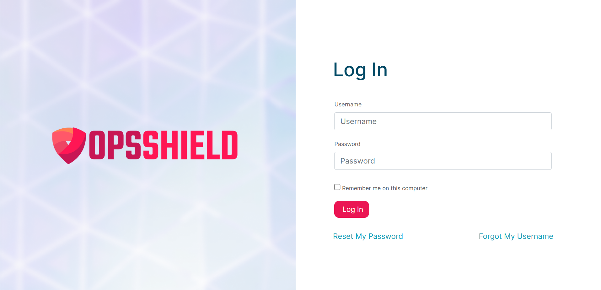
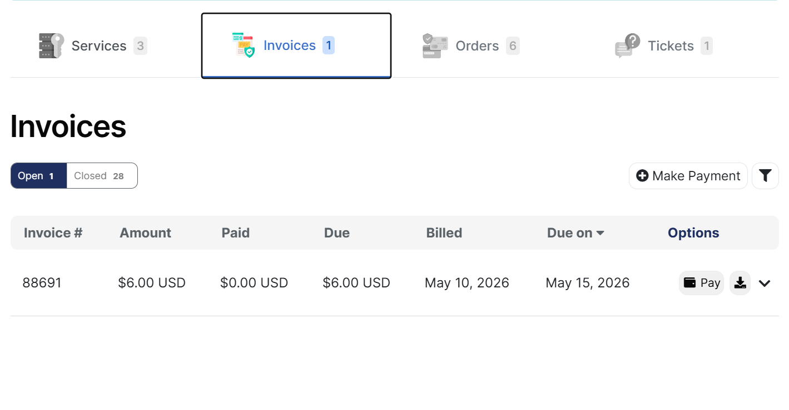
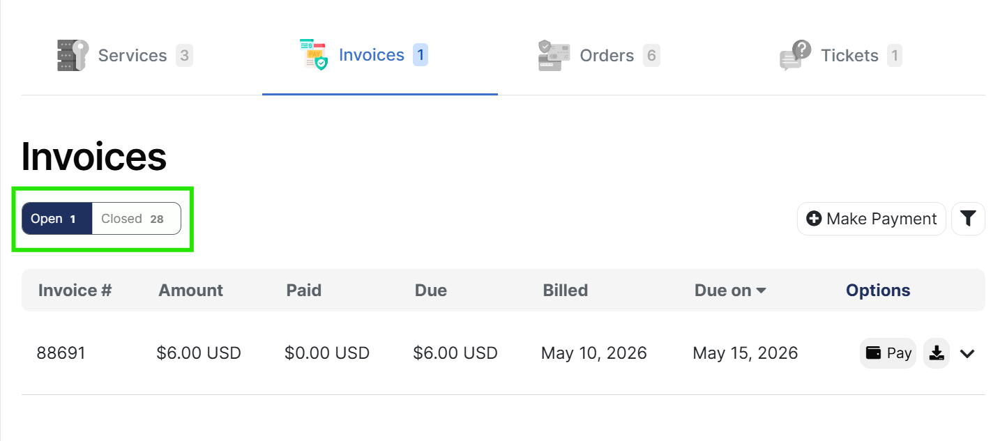
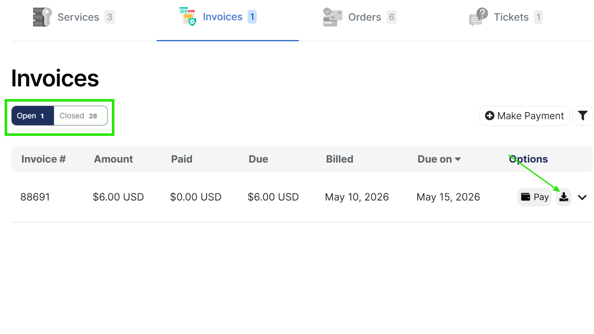

# Billing and Payments

The OPSSHIELD Client Area provides centralized billing and subscription management for all services.

You can use the portal to:

- View invoices
- Update payment methods
- Manage subscriptions
- Review transactions
- Track renewals
- Download billing documents

---

## Paying an Invoice

### Manual Payment

1. Open the unpaid invoice
2. Select a payment gateway
3. Complete payment

### Automatic Payments

If auto-renewal is enabled and a valid payment method exists, invoices may be paid automatically.

---

## Supported Payment Methods

Available methods may vary depending on region and gateway availability.

Examples may include:

- Credit cards
- Debit cards
- PayPal
- Bank transfer
- Regional payment providers

---

## Manage  Credit card details

You can update credit card details, to update:

1. Open [Payment accounts](https://manage.opsshield.com/client/accounts/add/cc/)
2. You have the option to Add payment account and Credit handling

:::warning
 Expired payment methods can cause failed renewals and service interruptions.
:::
---

## Failed Payments

Common causes include:

- Insufficient balance
- Expired cards
- Bank security blocks
- International payment restrictions

### Recommended Actions

- Retry the payment
- Contact your bank
- Use an alternate payment method
- Ensure online/international transactions are enabled

---

## Automatic Renewals

Clients can set up automatic renewals using one of two options:

- **Credit card** — Client adds a credit card to their account. Renewal charges are billed automatically on each cycle.
- **PayPal subscription** — Client sets up a PayPal subscription linked to the specific service or license. Each service has its own individual subscription.

---

## ⚠️ Critical — PayPal Cancellation Rule

When a license or service is cancelled, the corresponding PayPal subscription **must be cancelled at the same time**.

Failing to do so will cause the customer to continue being charged even after cancellation. Any payment received after cancellation will be added to the client's account as **credit** (not refunded automatically).

---

## Subscription and Renewal Questions

---

## How to View and Download Invoices from the OPSSHIELD Client Portal

All your cPGuard billing history and invoices are available directly from the **OPSSHIELD client portal**. You can view open or closed invoices, check payment status, and download any invoice as a PDF — all in a few clicks.

---

### Step 1 : Log In to the OPSSHIELD Client Portal

Open the following URL in your browser and log in with your registered email address and password:

[https://manage.opsshield.com/client/login/](https://manage.opsshield.com/client/login/)

:::tip
Your username is the email address used when you created your OPSSHIELD account at the time of purchase. If you have forgotten your password, refer to the [Reset Your OPSSHIELD Account Password](../shared/account#resetting-your-password) guide.
:::

---

### Step 2 : Navigate to the Invoices Section

Once logged in, click the **Invoices** tab at the top of the dashboard. This opens your complete invoice list showing all billing records associated with your account.

The invoice list displays the following details for each invoice:

| Column | Description |
|---|---|
| **Invoice #** | Unique invoice number |
| **Amount** | Total invoice amount |
| **Paid** | Amount already paid |
| **Due** | Outstanding balance remaining |
| **Billed** | Date the invoice was issued |
| **Due on** | Payment due date |
| **Options** | Actions available for the invoice |

---

### Step 3 : Filter by Open or Closed Invoices

At the top-left of the invoice list, you will see two tabs:

- **Open** : invoices with an outstanding balance that are awaiting payment
- **Closed** : fully paid or cancelled invoices

Click the appropriate tab to filter the list based on your preference. For example, select **Open** to see any pending payments, or **Closed** to review your full payment history.

---

### Step 4 : Download the Invoice

Once you have located the invoice you need, look at the **Options** column on the right side of that invoice row. Click the **download icon** (⬇) to open the invoice.

From the invoice view, you can:

- **Review the invoice in full detail** — line items, amounts, dates, and billing information
- **Download it as a PDF** by clicking the **"Download Invoice"** button

---

### Still Having Trouble?

Contact the OPSSHIELD support team for assistance if you encounter any issues :

[Raise a Support Ticket](https://manage.opsshield.com/client/plugin/support_manager/client_tickets/departments/)

### Renewal Notifications

Reminder emails may be sent:

- Before due dates
- On overdue invoices
- After successful payments

---

## Taxes and Billing Address

Your billing address and tax information may appear on invoices.

Tax applies to **Indian clients only**.

- GST is included for Indian clients.

### Keep Updated

- Company name
- VAT/GST details
- Billing address
- Contact information

---

##  Refund Policy

We strive to provide high-quality services and products that meet your needs. However, we understand that certain circumstances may require a refund. Refunds may be issued in genuine cases where a substantial amount of service time remains unused, or when the amount to be refunded is reasonable enough to offset any potential loss for either party, including transaction fees charged by the payment gateway.

## Evaluation Criteria

Refund requests will be evaluated on a case-by-case basis, considering the following factors:

- The remaining number of days or service duration left on the license or product.
- The amount paid and any transaction fees that may apply.

## Non-Refundable Products

Certain products may still be sold "as is" and may not be eligible for refunds, except in cases where a valid reason and substantial remaining service time exist.

## Refund Process

If a refund is approved, it can be processed either as a credit to your account for future purchases or, where applicable, returned via the payment method used. Please note that any applicable transaction charges imposed by the payment gateway may be deducted from the refunded amount.

---

## Supported Currencies

We currently support the following currencies:

- **INR** — Indian Rupee
- **USD** — US Dollar

---

## Invoice Not Received

If you do not receive invoice emails:

### Check

- Spam/Junk folder
- Email filtering
- Mailbox quota
- Correct registered email address

---

## Overdue Invoices

Overdue invoices may eventually lead to:

- Service suspension
- License expiration
- Disabled renewals

### Recommended

Pay invoices before the due date whenever possible.

---

## Billing Security

For security reasons:

- Payment information is processed securely
- Billing systems are separated from the App Portal
- Access should be protected using 2FA

---

## Frequently Asked Questions

### Can I manually renew early?

Yes. You can pay invoices before the due date.

---

### Why was my service suspended?

Usually due to unpaid invoices or failed renewals.

---

### Can I change my billing cycle?

To change billing cycle you need to contact the support.
[Raise a Support Ticket](https://manage.opsshield.com/client/plugin/support_manager/client_tickets/departments/)

---

### Do you store card details directly?

Payment handling depends on the configured payment gateway and processor.

---

### Can I get invoice copies later?

Yes. Previous invoices remain available in the client area.

---

## Related Guides

- [Account Management](./account)
- [Licenses & Plans](./license/overview)
