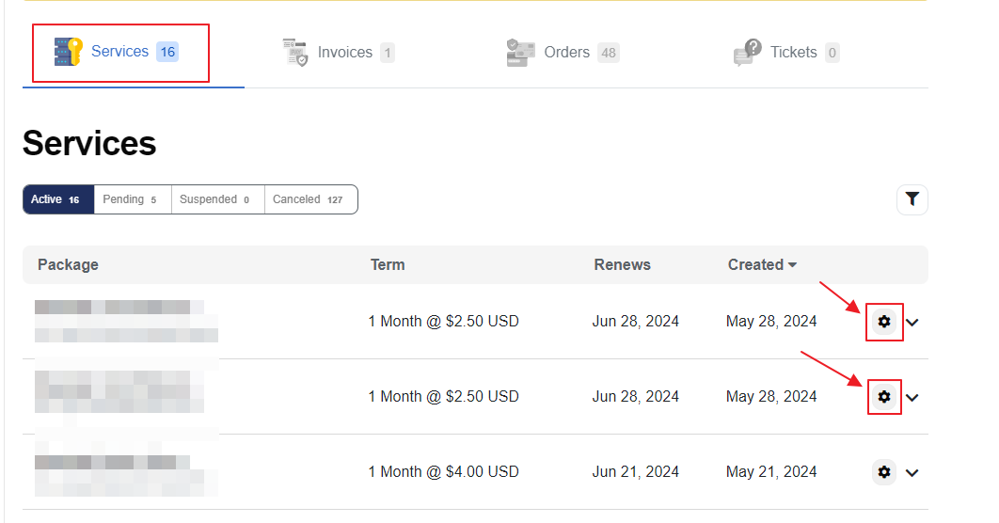
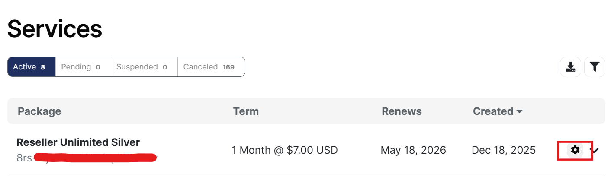
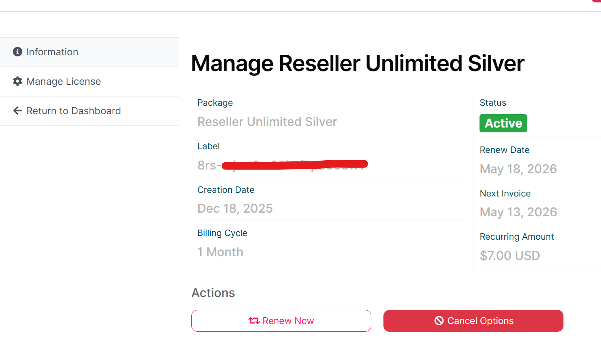
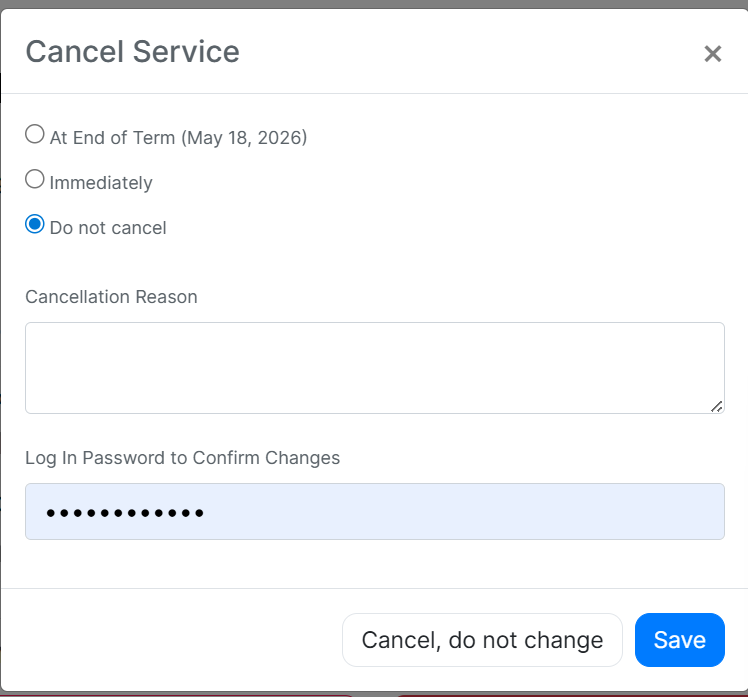

# Licenses and Plans

The OPSSHIELD Client Area allows you to manage all cPGuard and cPGuard X licenses from a single location.

This includes:

- Purchasing licenses
- Starting trials
- Upgrading plans
- Reissuing licenses
- Managing linked servers
- Cancelling services
- Reviewing renewal information

---

## Accessing License Management

1. Login to `https://manage.opsshield.com`
2. Under **Services**
3. Select the license you wish to manage



---
## Trial & Purchasing a License

To start a trial or purchase a new license, visit:
[https://manage.opsshield.com/order/main/index/cPGuard_Licenses](https://manage.opsshield.com/order/main/index/cPGuard_Licenses)

---

## Trial License

- The trial license has **no limitations** — all features available in the paid version are included
- The trial license will **expire automatically** at the end of its term
- To continue using cPGuard after the trial, you will need to purchase a new license and apply it to your server

---

## Purchase a Paid License

Once you are satisfied with the trial and ready to proceed with a paid plan, purchase a license from:
[https://manage.opsshield.com/order/main/index/cPGuard_Licenses](https://manage.opsshield.com/order/main/index/cPGuard_Licenses)

After completing the payment, you will receive a new license key. To activate it on your server, run the following command replacing `LICENSE-KEY` with your actual key:

```bash
cpgcli license --key LICENSE-KEY
```

---

## Switch from Trial to Standard License

There is no direct option to convert a trial license to a paid license. You need to:

1. Cancel the current trial license
2. Purchase a new Standard license
3. Apply the new license key on your server

> ⚠️ A canceled license cannot be restored.

---

## Upgrade from Standard to Unlimited License

There is no direct upgrade option available. You need to:

1. Purchase a new Unlimited license
2. Apply the new license key on your server
3. Cancel the old Standard license

> ⚠️ A canceled license cannot be restored.


---

## Cancelling a License

1. Log in to your account at the [OPSShield Portal](https://manage.opsshield.com/index.php/client/login/)
2. Once logged in, find the license key you wish to cancel under the **Services** section
3. Click on the **gear icon** corresponding to the license



4. Click on **Cancel** option



5. A pop-up window will appear with the following options:



---

**Cancel Service**

| Option | Description |
|---|---|
| **At End of Term** | Cancels the license at the end of the current billing period |
| **Immediately** | Cancels the license right away |
| **Do not cancel** | Keeps the license active |

6. Select your preferred cancellation option
7. Enter a **Cancellation Reason**
8. Enter your **Log In Password** to confirm the changes
9. Click **Cancel Service** to proceed

> ⚠️ Select the option carefully based on your needs. This action cannot be undone once confirmed.


