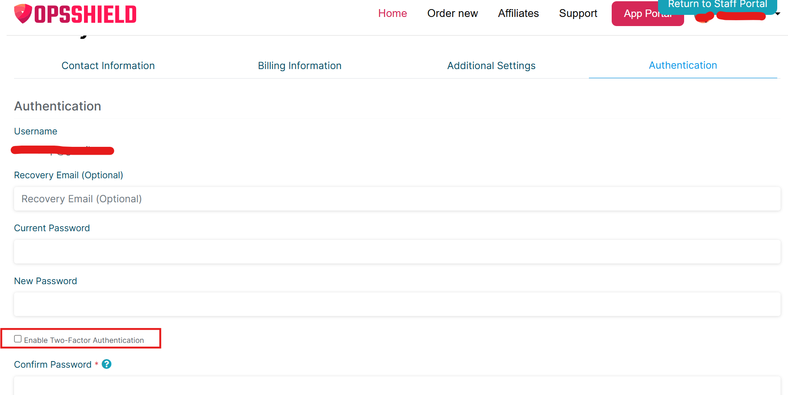

To enable 2FA on your OPSShield account:

1. Go to [https://manage.opsshield.com/client/main/edit/](https://manage.opsshield.com/client/main/edit/)
2. Select the **Authentication** tab
3. Enable the **"Enable Two-Factor Authentication"** option
4. Scan the QR code using an authenticator app on your mobile device

---

> **Note:**
> When enabling 2FA, both your **OTP token** (from the authenticator app) and your **account password** are required.
>
> You will need to enter your account password in two fields:
>
> 1. **Current Password**
> 2. **Confirm Password**
>
> Make sure to enter the correct password in both fields along with the right OTP token from your device for 2FA to be enabled successfully.