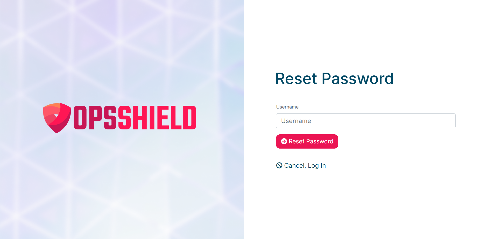

# How to Reset Your OPSSHIELD Account Password

If you have forgotten your OPSSHIELD client portal password, you can reset it in just a few steps directly from the login page. This guide walks you through the full process.

---

## Before You Begin — Know Your Username

Your OPSSHIELD username is the **email address you used when creating your account** at the time of purchase. If you are unsure which email address that was, check your inbox for any order confirmation or welcome emails from OPSSHIELD.

:::tip
Your username is always your registered email address. Not a custom username you may have chosen elsewhere. Use the email address associated with your OPSSHIELD purchase.
:::

---

## Steps to Reset Your Password

### Step 1 : Go to the OPSSHIELD Client Portal Login Page

Open the following URL in your browser:

[https://manage.opsshield.com/client/login/](https://manage.opsshield.com/client/login/)

---

### Step 2 : Click "Reset My Password"

On the login page, click the **"Reset My Password"** link. This takes you to the password reset form.

---

### Step 3 : Enter Your Username and Submit

On the password reset form:

1. Enter your **registered email address** in the username field.
2. Click the **"Reset Password"** button.

---

### Step 4 : Check Your Email for the Reset Link

A password reset email will be sent to your registered email address. Open the email and click the reset link inside to set a new password.

:::note
If you don't see the reset email in your inbox within a few minutes, check your **spam or junk folder**. Automated emails from account management systems are sometimes filtered incorrectly.
:::

---

## Still Having Trouble?

If you did not receive the reset email or are unsure which email address is registered on your account, contact the OPSSHIELD support team for assistance:

[Raise a Support Ticket](https://manage.opsshield.com/client/plugin/support_manager/client_tickets/departments/)

---

