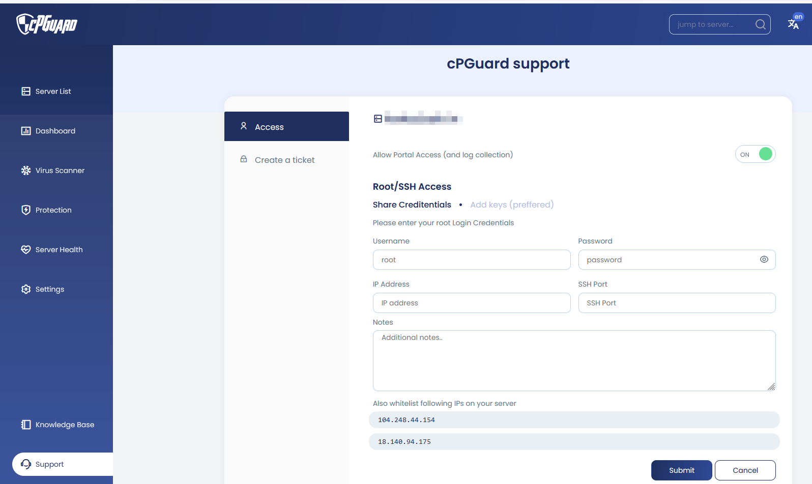
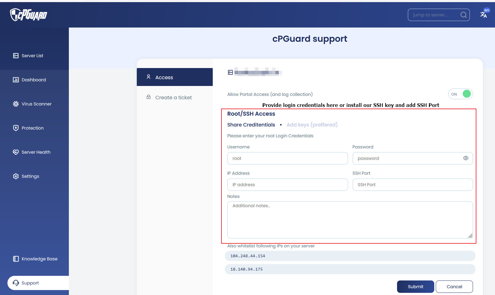

# How to Grant Server Access to the cPGuard Support Team

When troubleshooting deep-level issues with cPGuard, the OPSSHIELD support team may sometimes need direct access to your server to inspect log files, check configurations, or replicate specific problems. The cPGuard App Portal provides a secure, built-in way to grant this access without ever sending credentials over email or external communication channels.

{/* comment */}

---

## Two Types of Access

There are two distinct levels of access the support team may need depending on the nature of the issue:

| Access Type | When Needed | How to Grant |
|---|---|---|
| **UI Access** | General troubleshooting, log collection via App Portal | App Portal toggle or CLI |
| **SSH Access** | Deep log inspection, replicating server-specific issues | CLI key install or App Portal credential input |

In most cases, **UI access** is sufficient. SSH access is only requested for more complex issues that require root-level server inspection.

---

## Granting UI Access

UI access allows the support team to view your server's data, logs, and configuration through the App Portal. It also enables automated log collection to assist with diagnosis.

### Via the App Portal

1. Log in to the [cPGuard App Portal](https://app.opsshield.com) and open your server dashboard.
2. Click **Support** from the left-side menu panel (bottom-left option).
3. Enable the **"Allow Portal Access (and log collection)"** switch.




### Via CLI

```bash
cpgcli support-access --grant
```

This command enables UI access and simultaneously installs the OPSSHIELD SSH key for the root user on your server.

:::tip
The CLI command is a quick way to grant both UI and SSH access in a single step useful when the support team asks you to run it as part of a troubleshooting session.
:::

---

## Granting SSH Access

SSH access gives the support team root-level access to the server for in-depth investigation. cPGuard provides two secure options for this — neither requires sending passwords over email.

### Option 1 : Install the OPSSHIELD SSH Key (Recommended)

Run the following command to install the OPSSHIELD SSH public key for the root user on your server:

```bash
cpgcli support-access --grant
```

Once the key is installed, inform the support team of your server's IP address and SSH port via the support ticket. They will connect using their private key — no password required.

:::note
You may also need to **whitelist the OPSSHIELD support server IP addresses** on your firewall or CSF/IPTables rules to allow the inbound SSH connection. Ask the support team for their IP addresses if needed.
:::

### Option 2 : Submit Credentials Securely via the App Portal

If you prefer to provide root login credentials directly, you can do so securely through the Support page in the App Portal:

1. Open the **Support** page from your server dashboard in the App Portal.
2. Enter your server login credentials in the provided form.
3. Add any additional access notes — for example, if the support team needs to log in as a non-root user and then `su` to root, note that here.
4. Submit the form.




**How credentials are protected:**

- Credentials are **encrypted and stored** in the App Portal
- They are **visible only to the support team** — not even the server owner can view them after submission
- To correct an entry, you must **overwrite** the existing data — it cannot be read back
- All stored credentials are **automatically deleted** when support access is revoked

:::warning
Never share server credentials over email, chat, or any external channel. Always use the App Portal's secure credential submission form or the SSH key method above.
:::

---

## Checking Support Access Status

To check whether support access is currently active on your server:

```bash
cpgcli support-access --status
```

---

## Revoking Support Access

Once the support team has resolved your issue, you should revoke access promptly. OPSSHIELD does not retain server access or access your server after troubleshooting is complete, but revoking access from your side is good practice.

### Via the App Portal

1. Go to the **Support** page on your server dashboard.
2. Disable the **"Allow Portal Access (and log collection)"** switch.

### Via CLI

```bash
cpgcli support-access --revoke
```

Revoking access also removes all stored credentials from the App Portal automatically.


---

### Security FAQ: Support Access & SSH Permissions

When granting access to your server, it is natural to have questions about how our keys interact with your system. Below are the most common security concerns addressed.

---

#### 1. What does the `support-access --grant` command actually do?

When you run this command, the cPGuard agent performs three specific actions:

* **API Handshake:** It notifies the App Portal that your server is now "Open" for a support session.
* **Key Injection:** It appends the official **OpsShield Support Public Key** to the `/root/.ssh/authorized_keys` file.
* **Permission Check:** It ensures the `.ssh` directory and `authorized_keys` file have the correct strict permissions (typically `700` and `600`) to remain secure.

#### 2. Can I restrict support to a non-root user?

Yes. If your internal security policy prohibits direct root login:

1. Provide the credentials for a standard user via the **Secure Vault** in the App Portal.
2. Include a note in the "Additional Comments" field (e.g., *"Login as 'operator', then sudo to root"*).
3. Ensure that the user has the necessary `sudo` privileges to read system logs (e.g., `/var/log/cpguard/`).

### 3. How do I know the support access is fully revoked?

You can verify that access has been removed through the App Portal UI or directly on your server's filesystem.

#### Verifying via the App Portal

* **Support Page:** Navigate to the **Support** section in your Server Dashboard. The "Allow Portal Access" switch should be in the **Off** position.
* **User Management:** Click on your **Profile Picture** in the top right corner and select **Users**. During an active support session, an "OPSSHIELD Support" user is temporarily created. Once revoked, this user will no longer appear in the list. You can also manually delete this user from this page to instantly terminate UI access.

#### Verifying Server-Level (SSH) Access

When you run the `cpgcli support-access --revoke` command, the cPGuard agent automatically scans your `authorized_keys` file and purges the specific public key string associated with our support team.

> **Manual Verification Tip:**
> To be 100% certain the key is gone, run the following command in your terminal:
> ```bash
> grep "opsshield" /root/.ssh/authorized_keys
> ```
> 
> If the command returns **no output**, the key has been successfully purged from your server.

#### 4. Does granting access open any new ports on my firewall?

No. Our support team connects via your **existing SSH port** (usually 22, or your custom port). You do not need to open any new inbound ports. However, ensure that our Support IP addresses (provided upon request or listed in the Portal) are not explicitly blacklisted in your hardware firewall.

#### 5. Is my data encrypted while stored in the Portal?

Absolutely. We use **AES-256 encryption** for all stored credentials. The decryption key is only available to the authenticated support engineer assigned to your ticket and is never exposed to the web interface after submission.

